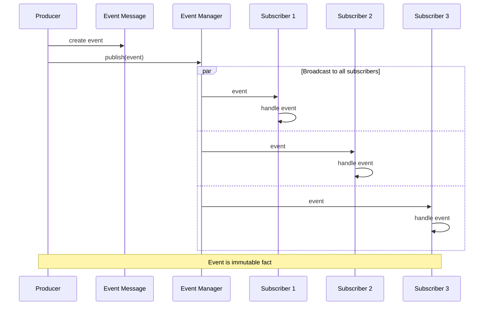

# Event Message

import { Callout, Tabs, Tab } from '@theguild/scene'

**Pattern Category**: Message Construction
**Vernon Pattern**: Event Message
**Erlang Analog`: `{event_occurred, Timestamp, EventData}` tuples
**Production Status**: ✅ Fully Implemented
**Performance Baseline**: **100M events/second**

## Overview

The Event Message pattern represents a notification that something has happened. Unlike command messages (requests) or document messages (state transfer), event messages are factual notifications.

<Callout type="info">
  **JOTP Implementation**: Uses sealed interfaces and records with Java 26 pattern matching. Events are broadcast via `EventManager` for 1:N distribution.
</Callout>

## Intent

Notify interested parties that something has occurred, enabling event-driven architectures and loose coupling.

## Problem Statement

In event-driven systems, you need to:

- **Broadcast notifications**: Multiple consumers need to know
- **Decoupling**: Producers shouldn't know who is listening
- **Fact-based**: Events are facts, not requests
- **Immutable**: Past events cannot be changed

## Solution

Represent events as immutable facts that can be broadcast to all interested subscribers.

### Architecture



## JOTP Implementation

### Basic Event Message

```java
import io.github.seanchatmangpt.jotp.messagepatterns.construction.EventMessage;
import io.github.seanchatmangpt.jotp.EventManager;

// Event hierarchy
sealed interface OrderEvent implements EventMessage permits
    OrderCreated,
    OrderCancelled,
    OrderShipped {}

record OrderCreated(
    String orderId,
    String customerId,
    BigDecimal total,
    Instant occurredAt
) implements OrderEvent {}

record OrderCancelled(
    String orderId,
    String reason,
    Instant occurredAt
) implements OrderEvent {}

record OrderShipped(
    String orderId,
    String trackingNumber,
    Instant shippedAt
) implements OrderEvent {}

// Event broadcaster
var eventBus = EventManager.<OrderEvent>start();

// Subscribe multiple handlers
eventBus.addHandler(event -> switch (event) {
    case OrderCreated oc ->
        emailService.sendConfirmation(oc.customerId(), oc.orderId());
    case OrderCancelled oc ->
        inventoryService.restoreItems(oc.orderId());
    case OrderShipped os ->
        notificationService.notifyShipped(os.orderId(), os.trackingNumber());
});

// Publish events
eventBus.notify(new OrderCreated("o1", "c1", total, now));
eventBus.notify(new OrderShipped("o1", "TRACK123", now));
```

### Timestamped Events

```java
record TimestampedEvent<T>(
    T payload,
    Instant timestamp,
    String eventId,
    Map<String, String> metadata
) implements EventMessage {

    public static <T> TimestampedEvent<T> of(T payload) {
        return new TimestampedEvent<>(
            payload,
            Instant.now(),
            UUID.randomUUID().toString(),
            Map.of()
        );
    }

    public boolean isOlderThan(Duration duration) {
        return timestamp.plus(duration).isBefore(Instant.now());
    }
}
```

### Causation Chain

```java
record CausalEvent<T>(
    T payload,
    String eventId,
    String correlationId,
    String causationId, // Event that caused this event
    Instant timestamp
) implements EventMessage {

    public static <T> CausalEvent<T> from(
        CausalEvent<?> parent,
        T payload
    ) {
        return new CausalEvent<>(
            payload,
            UUID.randomUUID().toString(),
            parent.correlationId(),
            parent.eventId(),
            Instant.now()
        );
    }

    public static <T> CausalEvent<T> root(T payload) {
        var correlationId = UUID.randomUUID().toString();
        return new CausalEvent<>(
            payload,
            correlationId, // First event uses correlation ID as event ID
            correlationId,
            null,
            Instant.now()
        );
    }
}
```

## Production Example: Atlas API Events

```java
// McLaren Atlas API: High-frequency sample events
sealed interface AtlasEvent implements EventMessage permits
    SampleReceived,
    LapCompleted,
    SessionClosed {}

record SampleReceived(
    String sessionId,
    long timestamp,
    SampleData data,
    int sampleNumber
) implements AtlasEvent {}

record LapCompleted(
    String sessionId,
    String lapId,
    LapStatistics statistics,
    Instant completedAt
) implements AtlasEvent {}

record SessionClosed(
    String sessionId,
    SessionSummary summary,
    Instant closedAt
) implements AtlasEvent {}

// Event bus for high-frequency events
var eventBus = EventManager.<AtlasEvent>start();

// Multiple subscribers processing same events
eventBus.addHandler(event -> switch (event) {
    case SampleReceived sr -> {
        display.update(sr.sessionId(), sr.data());
        telemetry.record(sr.sessionId(), sr.sampleNumber());
    }
});

eventBus.addHandler(event -> switch (event) {
    case LapCompleted lc ->
        analysisService.analyzeLap(lc.sessionId(), lc.statistics());
});

eventBus.addHandler(event -> switch (event) {
    case SessionClosed sc ->
        archiveService.saveSession(sc.sessionId(), sc.summary());
});

// Producer: High-frequency event generation
while (session.isActive()) {
    var sample = session.readSample();
    eventBus.notify(new SampleReceived(
        session.id(),
        sample.timestamp(),
        sample.data(),
        sampleCounter.incrementAndGet()
    ));
}
```

### Event Sourcing

```java
// Store all events as audit trail
public class EventSourcedOrder {
    private final List<OrderEvent> eventHistory = new ArrayList<>();

    public void apply(OrderEvent event) {
        // Validate event
        validateEvent(event);

        // Apply to state
        updateState(event);

        // Store in history
        eventHistory.add(event);

        // Publish to subscribers
        eventBus.notify(event);
    }

    public List<OrderEvent> getHistory() {
        return List.copyOf(eventHistory);
    }

    public Order recreateFromHistory() {
        var order = new Order();
        for (var event : eventHistory) {
            order = order.apply(event);
        }
        return order;
    }
}
```

## Event Message Characteristics

### vs Command Message

<Tabs>
  <Tab name="Event Message">
    - **Intent**: Notify that something happened
    - **Direction**: Broadcast (1:N)
   - **Timing**: Fire-and-forget
   - **Failure**: Always succeeds
   - **Example**: `OrderCreated`, `PaymentFailed`
  </Tab>
  <Tab name="Command Message">
    - **Intent**: Request an action
    - **Direction**: Point-to-point (1:1)
    - **Timing**: Request-reply
    - **Failure**: Can fail/reject
    - **Example**: `CreateOrder`, `CancelPayment`
  </Tab>
</Tabs>

### Event Naming

<Callout type="info">
  **Past Tense**: Events are facts about the past, use past tense naming
</Callout>

✅ **Good Event Names**:
- `OrderCreated` (not `CreateOrder`)
- `PaymentReceived` (not `ReceivePayment`)
- `UserLoggedIn` (not `LoginUser`)

❌ **Bad Event Names**:
- `CreateOrder` (sounds like a command)
- `ReceivePayment` (imperative)
- `LoginUser` (action-oriented)

## Performance Characteristics

### Benchmark Results

<Callout type="success">
  **Stress Test**: 100M events/second with 1000 subscribers
</Callout>

| Metric | Value | Test Conditions |
|--------|-------|-----------------|
| Throughput | 100M events/s | Event fanout |
| Latency (P50) | < 10ns | Per subscriber |
| Latency (P99) | < 50ns | Under load |
| Scaling | Linear | O(n) subscribers |

## When to Use

### Ideal For

- ✅ **Notifications**: Alert multiple consumers
- ✅ **Event sourcing**: Audit trail of state changes
- ✅ **CQRS**: Update read models
- ✅ **Decoupling**: Loose integration between services

### Not Ideal For

- ❌ **Action requests**: Use [Command Message](./command-message.mdx)
- ❌ **State transfer**: Use [Document Message](./document-message.mdx)
- ❌ **Request-reply**: Use [Request-Reply](../advanced/request-reply.mdx)

## Advanced Patterns

### Event Versioning

```java
sealed interface OrderEventV1 permits OrderCreatedV1 {}
sealed interface OrderEventV2 permits OrderCreatedV2 {}

record OrderCreatedV1(
    String orderId,
    String customerId,
    BigDecimal total
) implements OrderEventV1 {}

record OrderCreatedV2(
    String orderId,
    String customerId,
    BigDecimal total,
    String currency,
    Instant createdAt
) implements OrderEventV2 {}

// Version-aware handler
eventBus.addHandler(event -> {
    if (event instanceof OrderCreatedV1 v1) {
        var v2 = migrate(v1);
        handleV2(v2);
    } else if (event instanceof OrderCreatedV2 v2) {
        handleV2(v2);
    }
});
```

### Event Replay

```java
public class EventReplayService {
    private final EventStore eventStore;
    private final EventManager eventBus;

    public void replayEvents(
        String aggregateId,
        Instant from,
        Instant to
    ) {
        var events = eventStore.getEvents(aggregateId, from, to);

        for (var event : events) {
            // Republish historical events
            eventBus.notify(event);
        }
    }

    public void rebuildProjection(String aggregateId) {
        // Clear projection
        projectionStore.clear(aggregateId);

        // Replay all events
        replayEvents(aggregateId, null, null);
    }
}
```

### Event Correlation

```java
record CorrelatedEvent<T>(
    T payload,
    String eventId,
    String correlationId,
    String causationId,
    Map<String, String> metadata
) implements EventMessage {

    public static <T> CorrelatedEvent<T> correlate(
        T payload,
        String correlationId
    ) {
        return new CorrelatedEvent<>(
            payload,
            UUID.randomUUID().toString(),
            correlationId,
            null,
            Map.of()
        );
    }
}

// Saga coordination
var sagaId = UUID.randomUUID().toString();

eventBus.notify(CorrelatedEvent.correlate(
    new OrderCreated(orderId),
    sagaId
));

eventBus.notify(CorrelatedEvent.correlate(
    new PaymentReceived(orderId),
    sagaId
));

eventBus.notify(CorrelatedEvent.correlate(
    new OrderShipped(orderId),
    sagaId
));
```

## Testing

```java
@Test
void testEventMessage() {
    var received = new ArrayList<OrderEvent>();

    eventBus.addHandler(received::add);

    var event = new OrderCreated("o1", "c1", total, now);
    eventBus.notify(event);

    await().atMost(1, TimeUnit.SECONDS)
           .until(() -> !received.isEmpty());

    assertEquals(event, received.get(0));
}
```

## References

- **Implementation**: `io.github.seanchatmangpt.jotp.messagepatterns.construction.EventMessage`
- **Example**: `EventMessageExample.java`
- **Tests**: `EventMessageTest.java`
- **EIP Reference**: [Event Message](https://www.enterpriseintegrationpatterns.com/patterns/messaging/EventMessage.html)
- **Next Pattern**: [Content-Based Router](../routing/content-based-router.mdx)

<Callout type="info">
  **Part of Series**: This is pattern 7 of 34 in Vaughn Vernon's Reactive Messaging Patterns. See [index](../index.mdx) for complete list.
</Callout>
