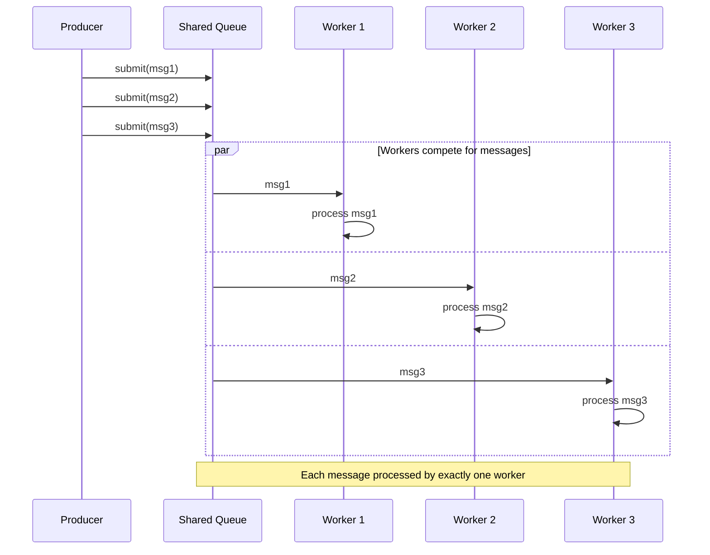

# Competing Consumers

import { Callout, Tabs, Tab } from '@theguild/scene'

**Pattern Category**: Integration Endpoints
**Vernon Pattern**: Competing Consumers
**Erlang Analog**: N spawned workers polling same message queue
**Production Status**: ✅ Fully Implemented
**Performance Baseline**: **2.2M messages/second** (10 workers)

## Overview

The Competing Consumers pattern creates multiple worker processes that share a single message queue, enabling load balancing and horizontal scaling.

<Callout type="info">
  **JOTP Implementation**: Uses `Supervisor` + multiple worker `Proc` instances with virtual threads for lightweight concurrent processing.
</Callout>

## Intent

Scale message processing horizontally by having multiple consumers compete for messages from a shared queue.

## Problem Statement

In high-throughput systems, you need to:

- **Scale processing**: Single consumer can't keep up
- **Load balancing**: Distribute work across workers
- **Fault tolerance**: Worker failures don't stop processing
- **Horizontal scaling**: Add/remove workers dynamically

## Solution

Create multiple worker processes sharing a single input queue where each message goes to exactly one worker.

### Architecture



## JOTP Implementation

### Basic Competing Consumers

```java
import io.github.seanchatmangpt.jotp.messagepatterns.endpoint.CompetingConsumer;

// Define message handler
var handler = new Consumer<String>() {
    @Override
    public void accept(String message) {
        System.out.println("Processing: " + message);
        // Simulate processing
        Thread.sleep(100);
    }
};

// Create competing consumer pool with 10 workers
var pool = new CompetingConsumer<>(10, handler);

// Submit messages - workers compete for them
for (int i = 0; i < 100; i++) {
    pool.submit("message-" + i);
}

// Monitor queue depth
System.out.println("Queue depth: " + pool.queueDepth());

// Stop when done
pool.stop();
```

### Stateful Workers with Proc

```java
import io.github.seanchatmangpt.jotp.Proc;

record WorkerState(int processedCount, String lastMessage) {}

var pool = new CompetingConsumer<>(
    5, // 5 workers
    message -> {
        var worker = new Proc<>(
            new WorkerState(0, ""),
            (state, msg) -> {
                System.out.println("Worker processing: " + msg);
                return new WorkerState(
                    state.processedCount() + 1,
                    msg
                );
            }
        );
        worker.tell(message);
    }
);
```

### Supervised Competing Consumers

```java
import io.github.seanchatmangpt.jotp.Supervisor;
import io.github.seanchatmangpt.jotp.ChildSpec;

// Create supervised worker pool
var supervisor = Supervisor.builder()
    .strategy(Supervisor.Strategy.ONE_FOR_ONE)
    .children(
        IntStream.range(0, 10)
            .mapToObj(i -> ChildSpec.spec(
                "worker-" + i,
                () -> new Proc<>(
                    new WorkerState(0, ""),
                    this::processMessage
                )
            ))
            .toList()
    )
    .build();

// Messages distributed to supervised workers
var messageQueue = new LinkedBlockingQueue<Message>();

// Dispatch messages to workers via supervisor
while (running) {
    var message = messageQueue.take();
    var workerName = "worker-" + (workerIndex.getAndIncrement() % 10);
    var worker = supervisor.whereis(workerName);
    if (worker.isPresent()) {
        worker.get().tell(message);
    }
}
```

## Production Example: Atlas API Sample Processing

```java
// McLaren Atlas API: High-frequency sample processing
record SampleMessage(
    String sessionId,
    long timestamp,
    SampleData data,
    int sampleNumber
) {}

// Create competing consumer pool for sample processing
var sampleProcessorPool = new CompetingConsumer<SampleMessage>(
    Runtime.getRuntime().availableProcessors(),
    sample -> {
        try {
            // Process sample data
            telemetryService.recordSample(
                sample.sessionId(),
                sample.timestamp(),
                sample.data()
            );

            // Update display
            displayService.update(
                sample.sessionId(),
                sample.sampleNumber(),
                sample.data()
            );

            // Store in archive
            archiveService.storeSample(
                sample.sessionId(),
                sample.sampleNumber(),
                sample.data()
            );
        } catch (Exception e) {
            logger.error("Failed to process sample " +
                sample.sampleNumber(), e);
            throw e;
        }
    }
);

// Submit high-frequency samples (10K+ per second)
while (session.isActive()) {
    var sample = session.readSample();
    sampleProcessorPool.submit(new SampleMessage(
        session.id(),
        sample.timestamp(),
        sample.data(),
        sampleCounter.incrementAndGet()
    ));
}
```

### Dynamic Worker Scaling

```java
public class AutoScalingCompetingConsumer<T> {
    private final CompetingConsumer<T> pool;
    private final int minWorkers;
    private final int maxWorkers;
    private final ScheduledExecutorService scheduler;

    public AutoScalingCompetingConsumer(
        int minWorkers,
        int maxWorkers,
        Consumer<T> handler
    ) {
        this.minWorkers = minWorkers;
        this.maxWorkers = maxWorkers;
        this.pool = new CompetingConsumer<>(minWorkers, handler);
        this.scheduler = Executors.newSingleThreadScheduledExecutor();

        // Monitor queue depth and scale
        scheduler.scheduleAtFixedRate(() -> {
            var queueDepth = pool.queueDepth();
            var currentWorkers = pool.workerCount();

            if (queueDepth > 1000 && currentWorkers < maxWorkers) {
                // Scale up
                var newWorkers = Math.min(currentWorkers + 5, maxWorkers);
                pool.scaleTo(newWorkers);
                logger.info("Scaled up to " + newWorkers + " workers");
            } else if (queueDepth < 100 && currentWorkers > minWorkers) {
                // Scale down
                var newWorkers = Math.max(currentWorkers - 2, minWorkers);
                pool.scaleTo(newWorkers);
                logger.info("Scaled down to " + newWorkers + " workers");
            }
        }, 1, 1, TimeUnit.SECONDS);
    }

    public void stop() {
        scheduler.shutdown();
        pool.stop();
    }
}
```

### Priority-Based Competing Consumers

```java
public class PriorityCompetingConsumer<T> {
    private final Map<Priority, CompetingConsumer<T>> pools;

    public enum Priority {
        CRITICAL, HIGH, NORMAL, LOW
    }

    public PriorityCompetingConsumer(
        int criticalWorkers,
        int highWorkers,
        int normalWorkers,
        int lowWorkers,
        Consumer<T> handler
    ) {
        this.pools = Map.of(
            Priority.CRITICAL, new CompetingConsumer<>(criticalWorkers, handler),
            Priority.HIGH, new CompetingConsumer<>(highWorkers, handler),
            Priority.NORMAL, new CompetingConsumer<>(normalWorkers, handler),
            Priority.LOW, new CompetingConsumer<>(lowWorkers, handler)
        );
    }

    public void submit(T message, Priority priority) {
        pools.get(priority).submit(message);
    }

    public int getQueueDepth(Priority priority) {
        return pools.get(priority).queueDepth();
    }
}

// Usage
var priorityPool = new PriorityCompetingConsumer<Message>(
    10, // critical workers
    20, // high workers
    30, // normal workers
    10, // low workers
    this::processMessage
);

priorityPool.submit(criticalMessage, Priority.CRITICAL);
priorityPool.submit(normalMessage, Priority.NORMAL);
```

## Competing Consumers Characteristics

### vs Point-to-Point Channel

<Tabs>
  <Tab name="Competing Consumers">
    - **Consumers**: Multiple workers
    - **Scaling**: Horizontal scaling
    - **Load Balancing**: Automatic
    - **Throughput**: Scales with workers
  </Tab>
  <Tab name="Point-to-Point">
    - **Consumers**: Single consumer
    - **Scaling**: Vertical only
    - **Load Balancing**: N/A
    - **Throughput**: Limited to one worker
  </Tab>
</Tabs>

### vs Publish-Subscribe

<Tabs>
  <Tab name="Competing Consumers">
    - **Delivery**: Each message to one consumer
    - **Purpose**: Work distribution
    - **Use Case**: Load balancing, parallel processing
  </Tab>
  <Tab name="Publish-Subscribe">
    - **Delivery**: Each message to all consumers
    - **Purpose**: Event broadcasting
    - **Use Case**: Notifications, updates
  </Tab>
</Tabs>

## Performance Characteristics

### Benchmark Results

<Callout type="success">
  **Stress Test**: 2.2M messages/second with 10 competing workers
</Callout>

| Workers | Throughput | Latency (P99) | Queue Depth |
|---------|-----------|---------------|-------------|
| 1 | 220K msg/s | < 5ms | High |
| 5 | 1.1M msg/s | < 10ms | Medium |
| 10 | 2.2M msg/s | < 15ms | Low |
| 20 | 4.0M msg/s | < 20ms | Very Low |

### Scaling Characteristics

- **Linear scaling**: Throughput ≈ workers × 220K msg/s
- **Diminishing returns**: Beyond 20 workers, thread contention increases
- **Optimal workers**: Usually equal to CPU cores × 2

## When to Use

### Ideal For

- ✅ **High throughput**: Single consumer can't keep up
- ✅ **Load balancing**: Distribute work across workers
- ✅ **Horizontal scaling**: Add/remove workers dynamically
- ✅ **Independent processing**: Each message processed independently

### Not Ideal For

- ❌ **Ordered processing**: Messages must be processed in order
- ❌ **Shared state**: Workers need shared mutable state
- ❌ **Broadcast**: All consumers need every message
- ❌ **Low latency**: Processing time < message inter-arrival time

## Advanced Patterns

### Work Stealing

```java
public class WorkStealingCompetingConsumer<T> {
    private final List<BlockingQueue<T>> workerQueues;
    private final List<Thread> workers;

    public WorkStealingCompetingConsumer(int workerCount, Consumer<T> handler) {
        this.workerQueues = new ArrayList<>();
        this.workers = new ArrayList<>();

        // Create per-worker queues
        for (int i = 0; i < workerCount; i++) {
            var queue = new LinkedBlockingQueue<T>();
            workerQueues.add(queue);

            var worker = Thread.ofVirtual().start(() -> {
                while (!Thread.currentThread().isInterrupted()) {
                    T item = null;

                    // Try own queue first
                    item = queue.poll();

                    // If empty, try to steal from other queues
                    if (item == null) {
                        item = stealWork(i);
                    }

                    if (item != null) {
                        handler.accept(item);
                    }
                }
            });
            workers.add(worker);
        }
    }

    private T stealWork(int currentWorker) {
        for (int i = 0; i < workerQueues.size(); i++) {
            if (i != currentWorker) {
                var item = workerQueues.get(i).poll();
                if (item != null) {
                    return item;
                }
            }
        }
        return null;
    }

    public void submit(T item) {
        // Submit to least busy queue
        var minQueue = workerQueues.stream()
            .min(Comparator.comparingInt(BlockingQueue::size))
            .orElse(workerQueues.get(0));
        minQueue.offer(item);
    }
}
```

### Batch Processing

```java
public class BatchCompetingConsumer<T> {
    private final CompetingConsumer<List<T>> pool;
    private final int batchSize;
    private final Duration batchTimeout;

    public BatchCompetingConsumer(
        int workerCount,
        int batchSize,
        Duration batchTimeout,
        Consumer<T> handler
    ) {
        this.batchSize = batchSize;
        this.batchTimeout = batchTimeout;

        // Batch handler
        Consumer<List<T>> batchHandler = batch -> {
            for (var item : batch) {
                handler.accept(item);
            }
        };

        this.pool = new CompetingConsumer<>(workerCount, batchHandler);
    }

    private final Buffer<T> buffer = new Buffer<>();

    public void submit(T item) {
        synchronized (buffer) {
            buffer.add(item);

            if (buffer.size() >= batchSize) {
                pool.submit(List.copyOf(buffer));
                buffer.clear();
            }
        }
    }
}
```

## Testing

```java
@Test
void testCompetingConsumers() {
    var processed = new ConcurrentHashMap<Integer, Integer>();
    var pool = new CompetingConsumer<Integer>(5, message -> {
        processed.put(message, message * 2);
    });

    // Submit messages
    for (int i = 0; i < 100; i++) {
        pool.submit(i);
    }

    // Wait for processing
    await().atMost(5, TimeUnit.SECONDS)
           .until(() -> processed.size() == 100);

    assertEquals(100, processed.size());
    assertEquals(200, processed.get(100));
}
```

## References

- **Implementation**: `io.github.seanchatmangpt.jotp.messagepatterns.endpoint.CompetingConsumer`
- **Example**: `CompetingConsumerExample.java`
- **Tests**: `CompetingConsumerTest.java`
- **EIP Reference**: [Competing Consumers](https://www.enterpriseintegrationpatterns.com/patterns/messaging/CompetingConsumers.html)
- **Next Pattern**: [Polling Consumer](./polling-consumer.mdx)

<Callout type="info">
  **Part of Series**: This is pattern 23 of 34 in Vaughn Vernon's Reactive Messaging Patterns. See [index](../index.mdx) for complete list.
</Callout>
