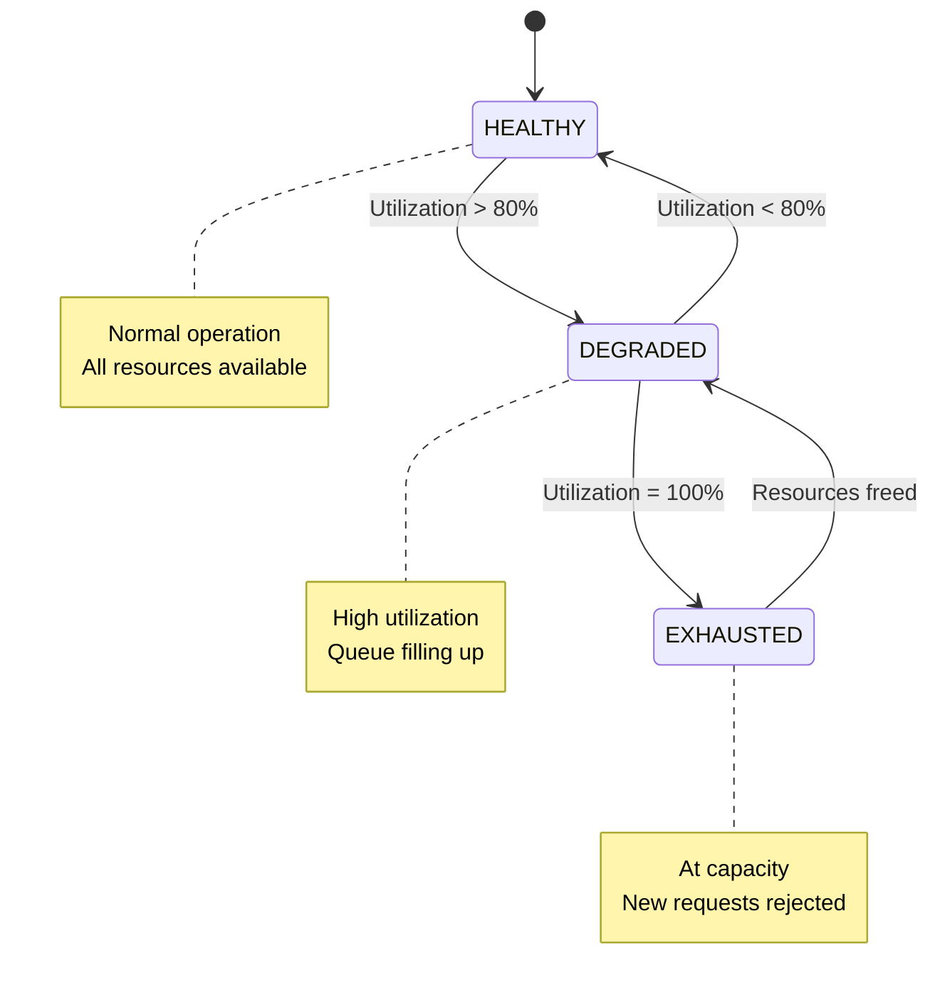
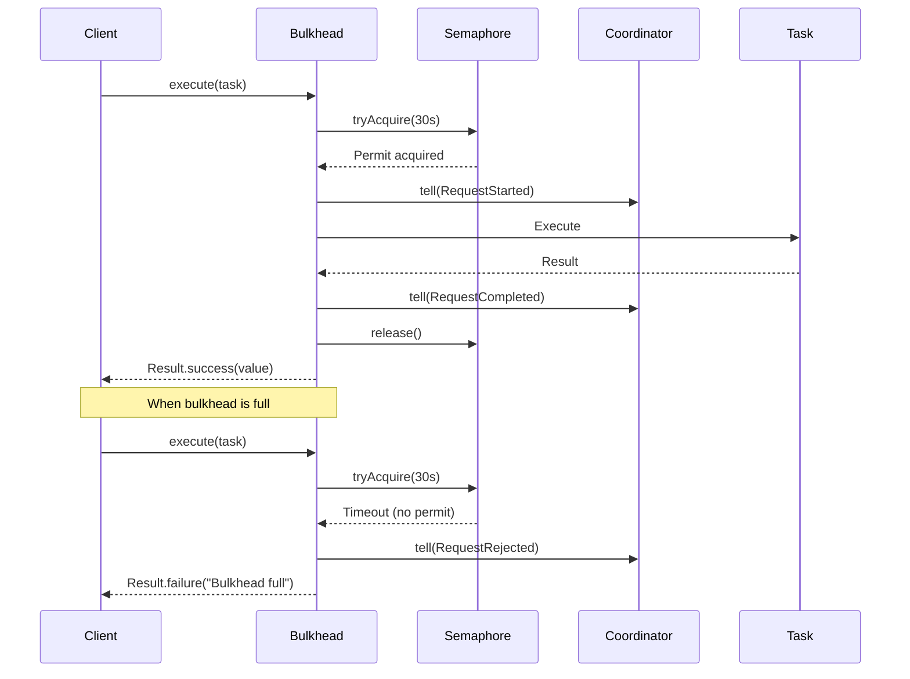

import { Tabs } from 'nextra/components'
import { Callout } from 'nextra/components'

# Bulkhead Pattern

**Enterprise Integration Pattern** • Resource Isolation

## Overview

The **Bulkhead** pattern prevents one feature from starving others by enforcing per-feature resource limits. Like ship bulkheads that compartmentalize hull sections to prevent flooding from spreading, JOTP's bulkhead isolation constrains concurrent requests, queue sizes, memory, and CPU usage per feature.

<Callout type="info">
**JOTP Implementation**: Uses `Proc<S,M>` coordinator processes with `Semaphore` for concurrent request limiting and state-based resource tracking.
</Callout>

## Problem Statement

In monolithic services without resource isolation:

- **Feature starvation** - Popular features consume all resources
- **Noisy neighbor problem** - One spike affects all features
- **Cascading failures** - Overloaded features crash the entire service
- **Unpredictable performance** - No resource guarantees

## Solution

JOTP's `BulkheadIsolationEnterprise` implements a three-state isolation boundary:



### Resource Limit Types

| Limit Type | Description | Default |
|------------|-------------|---------|
| **MaxConcurrentRequests** | Parallel executions allowed | 10 |
| **MaxQueueSize** | Pending requests in queue | 100 |
| **MaxMemoryMB** | Memory cap in MB | 512 |
| **MaxCpuPercent** | CPU usage threshold | 80% |

## Configuration

### Basic Configuration

```java
BulkheadConfig config = BulkheadConfig.builder("payment-processing")
    .limits(List.of(
        new ResourceLimit.MaxConcurrentRequests(20),
        new ResourceLimit.MaxQueueSize(50)
    ))
    .queueTimeout(Duration.ofSeconds(30))
    .alertThreshold(0.80)
    .build();

BulkheadIsolationEnterprise bulkhead = BulkheadIsolationEnterprise.create(config);
```

### Multi-Resource Configuration

```java
BulkheadConfig config = BulkheadConfig.builder("image-processing")
    .strategy(new BulkheadStrategy.ProcessBased())
    .limits(List.of(
        new ResourceLimit.MaxConcurrentRequests(5),
        new ResourceLimit.MaxQueueSize(20),
        new ResourceLimit.MaxMemoryMB(2048),
        new ResourceLimit.MaxCpuPercent(75)
    ))
    .queueTimeout(Duration.ofSeconds(60))
    .alertThreshold(0.75)
    .metricsEnabled(true)
    .build();
```

### Configuration Parameters

<Tabs items={['Conservative', 'Balanced', 'Aggressive']}>
<Tabs.Tab>
```java
BulkheadConfig.builder("critical-feature")
    .limits(List.of(
        new ResourceLimit.MaxConcurrentRequests(5),
        new ResourceLimit.MaxQueueSize(10)
    ))
    .queueTimeout(Duration.ofSeconds(10))
    .alertThreshold(0.70)
```
**Conservative**: Strict limits, quick rejection, predictable latency
</Tabs.Tab>
<Tabs.Tab>
```java
BulkheadConfig.builder("standard-feature")
    .limits(List.of(
        new ResourceLimit.MaxConcurrentRequests(20),
        new ResourceLimit.MaxQueueSize(50)
    ))
    .queueTimeout(Duration.ofSeconds(30))
    .alertThreshold(0.80)
```
**Balanced**: Good throughput with reasonable limits
</Tabs.Tab>
<Tabs.Tab>
```java
BulkheadConfig.builder("batch-processing")
    .limits(List.of(
        new ResourceLimit.MaxConcurrentRequests(100),
        new ResourceLimit.MaxQueueSize(500)
    ))
    .queueTimeout(Duration.ofMinutes(2))
    .alertThreshold(0.90)
```
**Aggressive**: High throughput, larger queues, longer waits
</Tabs.Tab>
</Tabs>

## Usage Examples

### Basic Pattern

```java
// Create bulkhead
BulkheadConfig config = BulkheadConfig.builder("api-calls")
    .limits(List.of(new ResourceLimit.MaxConcurrentRequests(10)))
    .build();
BulkheadIsolationEnterprise bulkhead = BulkheadIsolationEnterprise.create(config);

// Execute task within bulkhead
Result<String> result = bulkhead.execute(() -> {
    // Your resource-intensive operation
    return externalApi.call();
});

// Handle result
switch (result) {
    case Result.Success<String>(String value) -> {
        System.out.println("Success: " + value);
    }
    case Result.Failure<BulkheadException>(BulkheadException e) -> {
        System.err.println("Bulkhead rejected: " + e.getMessage());
    }
}
```

### Spring Boot Integration

```java
@Service
public class ImageProcessingService {
    private final BulkheadIsolationEnterprise bulkhead;

    public ImageProcessingService() {
        BulkheadConfig config = BulkheadConfig.builder("image-processing")
            .limits(List.of(
                new ResourceLimit.MaxConcurrentRequests(5),
                new ResourceLimit.MaxQueueSize(20),
                new ResourceLimit.MaxMemoryMB(2048)
            ))
            .queueTimeout(Duration.ofSeconds(30))
            .alertThreshold(0.80)
            .build();
        this.bulkhead = BulkheadIsolationEnterprise.create(config);
    }

    public ProcessedImage processImage(ImageUpload upload) {
        Result<ProcessedImage> result = bulkhead.execute(() -> {
            // Heavy image processing
            return imageProcessor.resize(upload, 1920, 1080);
        });

        return switch (result) {
            case Result.Success<ProcessedImage>(ProcessedImage img) -> img;
            case Result.Failure<BulkheadException>(_) ->
                ProcessedImage.failed("Service busy, please retry");
        };
    }

    // Health check endpoint
    public BulkheadState.Status getHealthStatus() {
        return bulkhead.getStatus();
    }

    @PreDestroy
    public void shutdown() {
        bulkhead.shutdown();
    }
}
```

### Per-Feature Isolation

```java
// Create separate bulkheads for different features
public class FeatureBulkheads {
    private final BulkheadIsolationEnterprise userBulkhead;
    private final BulkheadIsolationEnterprise orderBulkhead;
    private final BulkheadIsolationEnterprise paymentBulkhead;

    public FeatureBulkheads() {
        userBulkhead = BulkheadIsolationEnterprise.create(
            BulkheadConfig.builder("user-operations")
                .limits(List.of(new ResourceLimit.MaxConcurrentRequests(50)))
                .build()
        );

        orderBulkhead = BulkheadIsolationEnterprise.create(
            BulkheadConfig.builder("order-operations")
                .limits(List.of(new ResourceLimit.MaxConcurrentRequests(20)))
                .build()
        );

        paymentBulkhead = BulkheadIsolationEnterprise.create(
            BulkheadConfig.builder("payment-operations")
                .limits(List.of(new ResourceLimit.MaxConcurrentRequests(5)))
                .build()
        );
    }

    public User getUser(String id) {
        return userBulkhead.execute(() -> userRepository.findById(id))
            .orElseThrow(() -> new NotFoundException("User not found"));
    }
}
```

## Sequence Diagram



## Monitoring & Metrics

### Key Metrics

| Metric | Description | Alert Threshold |
|--------|-------------|-----------------|
| **Utilization %** | Current resource usage | > 80% = Warning |
| **Status** | HEALTHY/DEGRADED/EXHAUSTED | DEGRADED = Warning |
| **Queue Depth** | Pending requests | > 50% of max = Warning |
| **Rejection Rate** | Requests rejected | > 5% = Critical |

### Health Check Integration

```java
@Component
public class BulkheadHealthIndicator implements HealthIndicator {
    private final Map<String, BulkheadIsolationEnterprise> bulkheads;

    @Override
    public Health health() {
        var builder = Health.up();

        for (var entry : bulkheads.entrySet()) {
            String name = entry.getKey();
            BulkheadIsolationEnterprise bulkhead = entry.getValue();

            builder.withDetail(name + ".status", bulkhead.getStatus());
            builder.withDetail(name + ".utilization", bulkhead.getUtilizationPercent() + "%");

            if (bulkhead.getStatus() == BulkheadState.Status.EXHAUSTED) {
                return Health.down()
                    .withDetail(name, "Exhausted")
                    .build();
            }
        }

        return builder.build();
    }
}
```

### Prometheus Metrics

```java
// Micrometer integration
@Autowired
private MeterRegistry registry;

public void setupBulkheadMetrics(BulkheadIsolationEnterprise bulkhead) {
    // Gauge for utilization
    Gauge.builder("bulkhead.utilization", bulkhead, b -> b.getUtilizationPercent())
        .tag("feature", bulkhead.getConfig().featureName())
        .register(registry);

    // Counter for rejections
    Counter.builder("bulkhead.rejections")
        .tag("feature", bulkhead.getConfig().featureName())
        .register(registry);
}
```

### Grafana Dashboard Queries

```promql
# Bulkhead utilization per feature
bulkhead_utilization_percent{feature="payment-processing"}

# Rejection rate
rate(bulkhead_rejections_total[5m])

# Time spent in EXHAUSTED state
avg_over_time(bulkhead_state{state="EXHAUSTED"}[5m])
```

## Production Tuning

### Sizing Concurrent Requests

```java
// Based on thread pool and operation duration
int availableCores = Runtime.getRuntime().availableProcessors();
int blockingFactor = 100; // For I/O-bound operations
int targetUtilization = 80;

int maxConcurrent = (availableCores * blockingFactor * targetUtilization) / 100;

BulkheadConfig.builder("api-calls")
    .limits(List.of(
        new ResourceLimit.MaxConcurrentRequests(maxConcurrent)
    ))
    .build();
```

### Queue Size Calculation

```java
// Little's Law: L = λW
// Queue size = arrival_rate * average_wait_time

double requestsPerSecond = 100.0;
double averageProcessingTimeSeconds = 0.5;
double targetQueueWaitSeconds = 5.0;

int queueSize = (int) (requestsPerSecond * targetQueueWaitSeconds);

BulkheadConfig.builder("api-calls")
    .limits(List.of(
        new ResourceLimit.MaxConcurrentRequests(50),
        new ResourceLimit.MaxQueueSize(queueSize)
    ))
    .build();
```

### Dynamic Adjustment

```java
@Component
public class BulkheadTuner {
    private final BulkheadIsolationEnterprise bulkhead;
    private final MeterRegistry registry;

    @Scheduled(fixedRate = 60000) // Every minute
    public void adjustLimits() {
        double utilization = bulkhead.getUtilizationPercent();

        if (utilization > 90) {
            // Increase capacity if consistently high
            scaleUpBulkhead();
        } else if (utilization < 30) {
            // Decrease to save resources
            scaleDownBulkhead();
        }
    }

    private void scaleUpBulkhead() {
        // Implement scaling logic
        // May require creating new bulkhead instance
    }
}
```

## Multi-Tenant Isolation

```java
@Service
public class MultiTenantBulkheadManager {
    private final Map<String, BulkheadIsolationEnterprise> tenantBulkheads =
        new ConcurrentHashMap<>();

    public Result<T> executeForTenant(String tenantId, BulkheadTask<T> task) {
        BulkheadIsolationEnterprise bulkhead = tenantBulkheads.computeIfAbsent(
            tenantId,
            id -> BulkheadIsolationEnterprise.create(
                BulkheadConfig.builder(id)
                    .limits(List.of(
                        new ResourceLimit.MaxConcurrentRequests(
                            getTenantTierLimits(id)
                        )
                    ))
                    .build()
            )
        );

        return bulkhead.execute(task);
    }

    private int getTenantTierLimits(String tenantId) {
        // Return limits based on tenant subscription tier
        return switch (tenantService.getTier(tenantId)) {
            case PREMIUM -> 100;
            case STANDARD -> 50;
            case BASIC -> 10;
        };
    }
}
```

## Best Practices

<Callout type="success">
**DO** ✓
- Create separate bulkheads per feature or tenant
- Set alert thresholds at 70-80% utilization
- Monitor queue depth and rejection rates
- Use with Circuit Breaker for complete fault tolerance
- Size limits based on actual resource availability
- Include bulkhead status in health checks
</Callout>

<Callout type="error">
**DON'T** ✗
- Share bulkheads across unrelated features
- Set queue timeouts too long (user frustration)
- Forget to shutdown bulkheads in @PreDestroy
- Ignore EXHAUSTED state (service degraded)
- Use bulkhead for rate limiting per user (use Rate Limiter pattern)
- Set limits higher than actual resource capacity
</Callout>

## Testing

```java
@Test
public void testBulkheadRejectsWhenFull() {
    BulkheadConfig config = BulkheadConfig.builder("test")
        .limits(List.of(new ResourceLimit.MaxConcurrentRequests(2)))
        .queueTimeout(Duration.ofMillis(100))
        .build();
    BulkheadIsolationEnterprise bulkhead = BulkheadIsolationEnterprise.create(config);

    // Fill bulkhead
    CompletableFuture<Result<String>> task1 = CompletableFuture.supplyAsync(() ->
        bulkhead.execute(() -> { Thread.sleep(1000); return "done"; })
    );
    CompletableFuture<Result<String>> task2 = CompletableFuture.supplyAsync(() ->
        bulkhead.execute(() -> { Thread.sleep(1000); return "done"; })
    );

    Thread.sleep(100); // Ensure tasks started

    // Third task should be rejected
    Result<String> task3 = bulkhead.execute(() -> "should not execute");

    assertTrue(task3 instanceof Result.Failure);
    assertTrue(task3.error().getMessage().contains("timeout"));
}
```

## References

- **Implementation**: `io.github.seanchatmangpt.jotp.enterprise.bulkhead.BulkheadIsolationEnterprise`
- **Configuration**: `io.github.seanchatmangpt.jotp.enterprise.bulkhead.BulkheadConfig`
- **Related Patterns**: [Circuit Breaker](./circuit-breaker.mdx), [Retry](./retry.mdx)
- **Original Pattern**: [Bulkhead (Microsoft)](https://docs.microsoft.com/en-us/azure/architecture/patterns/bulkhead)

---

**Next**: [Retry Pattern](./retry.mdx) • **Previous**: [Circuit Breaker](./circuit-breaker.mdx)
