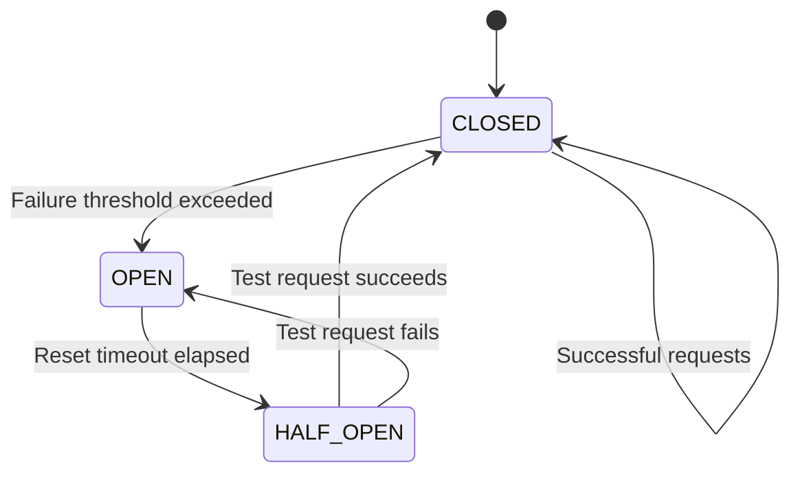
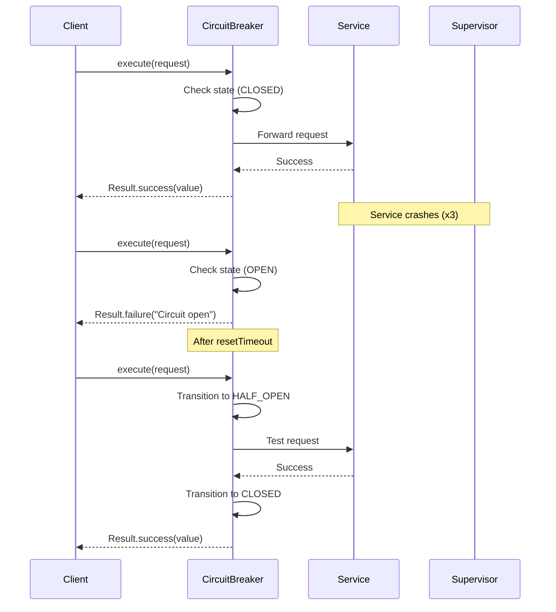

import { Tabs } from 'nextra/components'
import { Callout } from 'nextra/components'

# Circuit Breaker Pattern

**Enterprise Integration Pattern** • Fault Tolerance

## Overview

The **Circuit Breaker** pattern prevents cascading failures by automatically failing fast when a downstream service exceeds crash thresholds. It wraps potentially fragile operations with a state machine that trips open after repeated failures, protecting the system from overload and zombie processes.

<Callout type="info">
**JOTP Implementation**: Uses `Supervisor` with `ONE_FOR_ONE` strategy and restart intensity windows to automatically detect when a service crashes too frequently.
</Callout>

## Problem Statement

In distributed systems, calling a failing service repeatedly leads to:

- **Cascading failures** - Load propagates upstream, overwhelming callers
- **Resource exhaustion** - Threads, memory, and connections tied up waiting
- **Poor user experience** - Timeouts for every request
- **Zombie processes** - Services stuck in crash loops

## Solution

JOTP's `CircuitBreakerPattern` implements a three-state machine:



### State Transitions

| State | Behavior | Recovery Condition |
|-------|----------|-------------------|
| **CLOSED** | Requests pass through normally, failures counted | N/A (healthy state) |
| **OPEN** | Fail-fast, no requests reach service | `resetTimeout` elapses |
| **HALF_OPEN** | Single test request allowed | Test succeeds → CLOSED, fails → OPEN |

## Configuration

### Basic Configuration

```java
CircuitBreakerConfig config = CircuitBreakerConfig.of("payment-gateway");
// Defaults:
// - maxRestarts: 3
// - restartWindow: 60 seconds
// - resetTimeout: 10 seconds
// - failureThreshold: 3
```

### Custom Configuration

```java
CircuitBreakerConfig config = new CircuitBreakerConfig(
    "payment-gateway",           // Service name
    5,                           // Max restarts in window
    Duration.ofMinutes(2),       // Restart window
    Duration.ofSeconds(30),      // Reset timeout (OPEN→HALF_OPEN)
    5                            // Failures to trip circuit
);
```

### Configuration Parameters

<Tabs items={['Production', 'Development', 'Testing']}>
<Tabs.Tab>
```java
new CircuitBreakerConfig(
    "payment-service",
    10,                          // Higher threshold for prod
    Duration.ofMinutes(5),       // Longer window
    Duration.ofMinutes(2),       // Longer recovery time
    10                           // More failures before trip
)
```
**Production**: Conservative thresholds, longer recovery windows
</Tabs.Tab>
<Tabs.Tab>
```java
new CircuitBreakerConfig(
    "payment-service",
    3,                           // Quick detection
    Duration.ofSeconds(30),      // Short window
    Duration.ofSeconds(5),       // Fast recovery
    3                            // Sensitive to failures
)
```
**Development**: Fast feedback, quick recovery
</Tabs.Tab>
<Tabs.Tab>
```java
CircuitBreakerConfig.of("test-service")
// Or create with no timeout for deterministic tests
new CircuitBreakerConfig(
    "test-service",
    100,
    Duration.ofHours(1),
    Duration.ofMillis(1),
    100
)
```
**Testing**: Very permissive or deterministic behavior
</Tabs.Tab>
</Tabs>

## Usage Examples

### Basic Pattern

```java
// Create circuit breaker
CircuitBreakerConfig config = CircuitBreakerConfig.of("external-api");
CircuitBreakerPattern breaker = CircuitBreakerPattern.create(config);

// Execute operation with timeout
Result<String> result = breaker.execute(
    timeout -> {
        // Your potentially fragile operation here
        return externalApiClient.call(timeout);
    },
    Duration.ofSeconds(5)  // Operation timeout
);

// Handle result
switch (result) {
    case Result.Success<String>(String value) -> {
        System.out.println("Got: " + value);
    }
    case Result.Failure<CircuitBreakerException>(CircuitBreakerException e) -> {
        System.err.println("Circuit open or failed: " + e.getMessage());
    }
}
```

### Spring Boot Integration

```java
@Service
public class PaymentService {
    private final CircuitBreakerPattern breaker;

    public PaymentService() {
        CircuitBreakerConfig config = new CircuitBreakerConfig(
            "payment-gateway",
            5,
            Duration.ofMinutes(2),
            Duration.ofSeconds(30),
            5
        );
        this.breaker = CircuitBreakerPattern.create(config);
    }

    public PaymentResult processPayment(PaymentRequest request) {
        Result<PaymentResult> result = breaker.execute(
            timeout -> paymentGateway.charge(request, timeout),
            Duration.ofSeconds(10)
        );

        return switch (result) {
            case Result.Success<PaymentResult>(PaymentResult r) -> r;
            case Result.Failure<CircuitBreakerException>(_) ->
                PaymentResult.failed("Service unavailable");
        };
    }

    @PreDestroy
    public void shutdown() {
        breaker.shutdown();
    }
}
```

### State Monitoring

```java
// Add listener for state transitions
breaker.addListener((from, to) -> {
    logger.warn("Circuit breaker state changed: {} → {}", from, to);

    // Send alert to monitoring system
    if (to == CircuitState.Status.OPEN) {
        alertService.sendAlert("Circuit breaker OPEN for payment service");
    }
});

// Query current state
CircuitState state = breaker.getState();
System.out.println("Status: " + state.status());
System.out.println("Failures: " + state.failureCount());
```

## Sequence Diagram



## Monitoring & Metrics

### Key Metrics

| Metric | Description | Alert Threshold |
|--------|-------------|-----------------|
| **Circuit State** | Current state (CLOSED/OPEN/HALF_OPEN) | OPEN = Critical |
| **Failure Count** | Failures in current window | > 50% of threshold |
| **Transition Rate** | State changes per minute | > 5/min = Flapping |
| **Request Rejection Rate** | Requests rejected due to OPEN | > 10% = Degraded |

### Micrometer Integration

```java
// In your service class
@Autowired
private MeterRegistry registry;

public void setupMetrics(CircuitBreakerPattern breaker) {
    breaker.addListener((from, to) -> {
        registry.counter("circuitbreaker.transitions",
            "service", breaker.getConfig().serviceName(),
            "from", from.toString(),
            "to", to.toString()
        ).increment();
    });
}
```

### Prometheus Query Examples

```promql
# Circuit breaker open rate
rate(circuitbreaker_transitions_total{to="OPEN"}[5m])

# Average failure count
avg(circuitbreaker_failures) by (service)

# Services with open circuits
circuitbreaker_state{state="OPEN"}
```

## Production Tuning

### Threshold Selection

```java
// Calculate failure threshold based on SLA
double errorRate = 0.01;  // 1% acceptable error rate
int requestsPerMinute = 1000;
int acceptableFailuresPerWindow = (int) (requestsPerMinute * errorRate * 2);

CircuitBreakerConfig config = new CircuitBreakerConfig(
    "api-service",
    Math.max(3, acceptableFailuresPerWindow),  // At least 3
    Duration.ofMinutes(2),
    Duration.ofSeconds(30),
    Math.max(3, acceptableFailuresPerWindow)
);
```

### Reset Timeout Tuning

```java
// Based on backend recovery time
Duration backendRecoveryTime = estimateBackendRecoveryTime();
Duration resetTimeout = backendRecoveryTime.multipliedBy(3);

CircuitBreakerConfig config = new CircuitBreakerConfig(
    "service",
    5,
    Duration.ofMinutes(5),
    resetTimeout,  // Give backend time to recover
    5
);
```

### Multi-Layer Strategy

```java
// Layer 1: Per-endpoint circuit breakers
CircuitBreakerPattern userBreaker = CircuitBreakerPattern.create(
    CircuitBreakerConfig.of("user-api")
);
CircuitBreakerPattern orderBreaker = CircuitBreakerPattern.create(
    CircuitBreakerConfig.of("order-api")
);

// Layer 2: Global service breaker
CircuitBreakerPattern globalBreaker = CircuitBreakerPattern.create(
    new CircuitBreakerConfig(
        "all-external-apis",
        20,  // Sum of individual thresholds
        Duration.ofMinutes(10),
        Duration.ofMinutes(2),
        20
    )
);
```

## Error Handling

```java
Result<String> result = breaker.execute(task, timeout);

switch (result) {
    case Result.Success<String>(String value) ->
        // Handle success
        handleSuccess(value);

    case Result.Failure<CircuitBreakerException>(CircuitBreakerException e) ->
        // Handle failure with fallback
        if (e.getMessage().contains("Circuit breaker is OPEN")) {
            // Circuit is open - use cached data or default
            return getCachedData();
        } else {
            // Operation failed but circuit is closed
            return getDefaultResponse();
        }
}
```

## Best Practices

<Callout type="success">
**DO** ✓
- Set thresholds based on actual traffic patterns and SLA requirements
- Add monitoring for state transitions
- Implement fallback mechanisms for OPEN state
- Use different configurations per environment
- Log state changes with context
</Callout>

<Callout type="error">
**DON'T** ✗
- Share circuit breakers across unrelated services
- Set thresholds too low (false positives) or too high (late detection)
- Forget to shutdown breakers in @PreDestroy
- Ignore HALF_OPEN state test failures
- Use circuit breakers for rate limiting (use Bulkhead instead)
</Callout>

## Testing

```java
@Test
public void testCircuitBreakerTripsAfterThreshold() {
    CircuitBreakerConfig config = new CircuitBreakerConfig(
        "test-service",
        3,
        Duration.ofSeconds(10),
        Duration.ofMillis(100),
        3
    );
    CircuitBreakerPattern breaker = CircuitBreakerPattern.create(config);

    // Trigger failures to trip circuit
    for (int i = 0; i < 4; i++) {
        Result<String> result = breaker.execute(
            timeout -> { throw new RuntimeException("Fail"); },
            Duration.ofSeconds(1)
        );
        assertTrue(result instanceof Result.Failure);
    }

    // Circuit should now be open
    assertEquals(CircuitState.Status.OPEN, breaker.getState().status());
}
```

## References

- **Implementation**: `io.github.seanchatmangpt.jotp.enterprise.circuitbreaker.CircuitBreakerPattern`
- **Configuration**: `io.github.seanchatmangpt.jotp.enterprise.circuitbreaker.CircuitBreakerConfig`
- **Related Patterns**: [Retry](./retry.mdx), [Bulkhead](./bulkhead.mdx), [Fallback](./fallback.mdx)
- **Original Pattern**: [Circuit Breaker (Microsoft)](https://docs.microsoft.com/en-us/azure/architecture/patterns/circuit-breaker)

---

**Next**: [Bulkhead Pattern](./bulkhead.mdx) • **Previous**: [Enterprise Patterns Overview](./index.mdx)
