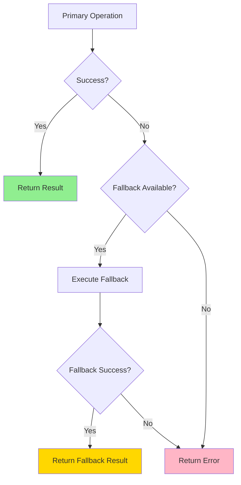
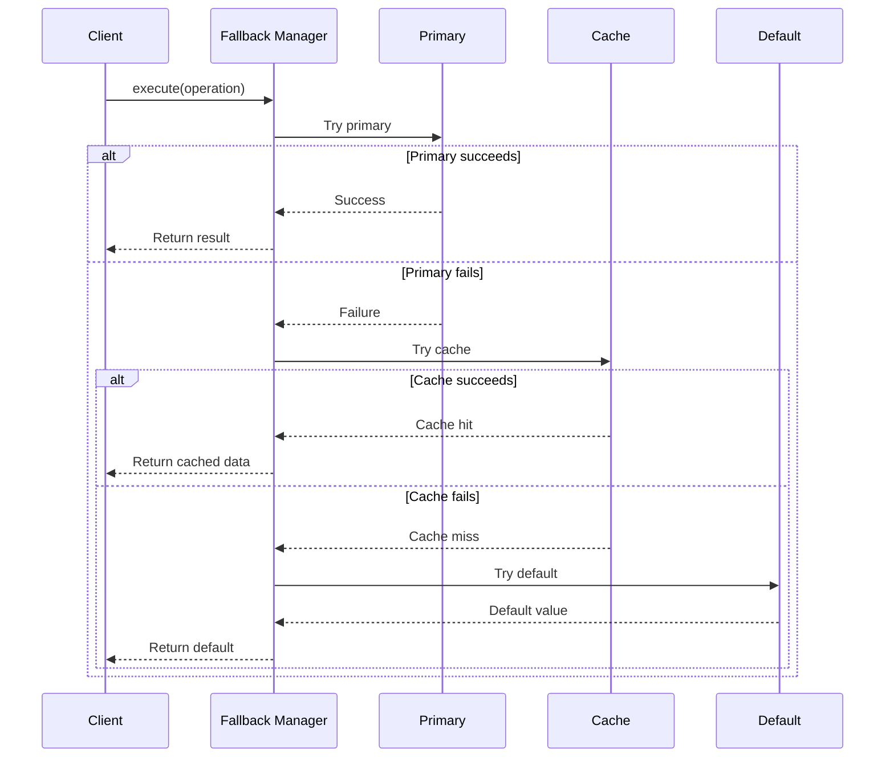

import { Tabs } from 'nextra/components'
import { Callout } from 'nextra/components'

# Fallback Pattern

**Enterprise Integration Pattern** • Graceful Degradation

## Overview

The **Fallback** pattern provides alternative execution paths when primary operations fail, enabling graceful degradation rather than complete service unavailability. JOTP implements fallback through `Result<T,E>` type matching, supervisor-based failover, and redundant process trees.

<Callout type="info">
**JOTP Implementation**: Uses `Result<T,E>` sealed types for pattern matching fallbacks, `Supervisor` with alternative child specs, and process registry for redundant service discovery.
</Callup>

## Problem Statement

When services fail without fallbacks:

- **Complete unavailability** - No service vs. degraded service
- **Poor user experience** - Errors instead of cached/stale data
- **Cascading failures** - Upstream callers impacted
- **Lost revenue** - Transactions fail instead of using alternatives

## Solution

JOTP's fallback pattern provides multiple degradation strategies:



### Fallback Strategies

| Strategy | Description | Use Case |
|----------|-------------|----------|
| **Cache Fallback** | Return stale cached data | Read-heavy operations |
| **Default Value** | Return sensible default | Non-critical data |
| **Alternative Service** | Call backup endpoint | High availability requirements |
| **Degraded Mode** | Limited functionality | Feature flags |
| **Async Retry** | Queue for later processing | Write operations |

## Configuration

### Basic Fallback with Result

```java
// Execute primary operation with fallback
Result<String> result = primaryOperation()
    .recover(error -> {
        logger.warn("Primary failed, using fallback: {}", error.getMessage());
        return fallbackOperation();
    });

// Pattern match on result
switch (result) {
    case Result.Success<String>(String value) -> handleSuccess(value);
    case Result.Failure<Exception>(Exception e) -> handleFailure(e);
}
```

### Supervisor-Based Failover

```java
// Supervisor with primary and backup children
Supervisor supervisor = Supervisor.create(
    Supervisor.Strategy.ONE_FOR_ALL
);

// Primary service
supervisor.supervise(
    "primary-service",
    initialState,
    primaryHandler
);

// Backup service (started on primary failure)
supervisor.supervise(
    "backup-service",
    backupInitialState,
    backupHandler
);
```

### Fallback Configuration

<Tabs items=['Cache Fallback', 'Default Value', 'Alternative Service']}>
<Tabs.Tab>
```java
@Service
public class ProductService {
    private final Cache<String, Product> cache;

    public Product getProduct(String id) {
        return primaryService.fetch(id)
            .recover(error -> {
                logger.warn("Primary fetch failed, using cache");
                return cache.getIfPresent(id);
            })
            .orElse(Product.notFound());
    }
}
```
**Cache Fallback**: Return stale data for better UX
</Tabs.Tab>
<Tabs.Tab>
```java
public class RecommendationService {
    public List<Recommendation> getRecommendations(String userId) {
        return mlService.recommend(userId)
            .recover(error -> {
                logger.info("ML service failed, using popular items");
                return getPopularItems();
            })
            .value();
    }
}
```
**Default Value**: Sensible defaults when service unavailable
</Tabs.Tab>
<Tabs.Tab>
```java
@Service
public class PaymentService {
    private final PaymentGateway primary;
    private final PaymentGateway backup;

    public PaymentResult charge(PaymentRequest req) {
        return primary.charge(req)
            .recover(error -> {
                logger.error("Primary gateway failed, trying backup");
                return backup.charge(req);
            })
            .value();
    }
}
```
**Alternative Service**: Redundant service providers
</Tabs.Tab>
</Tabs>

## Usage Examples

### Cache Fallback Pattern

```java
@Service
public class UserProfileService {
    private final ProcRef<UserState, UserMessage> userProc;
    private final Cache<String, User> profileCache;
    private final Duration cacheTimeout = Duration.ofMinutes(5);

    public User getUserProfile(String userId) {
        Result<User> result = fetchFromPrimary(userId)
            .recover(error -> {
                logger.warn("Primary fetch failed for user: {}, checking cache", userId);
                return fetchFromCache(userId);
            })
            .recover(error -> {
                logger.error("Cache miss for user: {}, returning default", userId);
                return User.guest();
            });

        return result.value();
    }

    private Result<User> fetchFromPrimary(String userId) {
        try {
            User user = userProc.ask(
                new UserMessage.GetProfile(userId),
                Duration.ofSeconds(2)
            );
            return Result.success(user);
        } catch (Exception e) {
            return Result.failure(e);
        }
    }

    private Result<User> fetchFromCache(String userId) {
        User cached = profileCache.getIfPresent(userId);
        if (cached != null) {
            return Result.success(cached);
        }
        return Result.failure(new NotFoundException("Cache miss"));
    }
}
```

### Circuit Breaker with Fallback

```java
@Service
public class RecommendationService {
    private final CircuitBreakerPattern breaker;
    private final Cache<String, List<Product>> cache;

    public List<Product> getRecommendations(String userId) {
        Result<List<Product>> result = breaker.execute(
            timeout -> recommendationEngine.recommend(userId),
            Duration.ofSeconds(3)
        );

        return switch (result) {
            case Result.Success<List<Product>>(List<Product> products) ->
                products;
            case Result.Failure<CircuitBreakerException>(_) ->
                getFallbackRecommendations(userId);
        };
    }

    private List<Product> getFallbackRecommendations(String userId) {
        // Try cache first
        List<Product> cached = cache.getIfPresent(userId);
        if (cached != null) {
            logger.info("Using cached recommendations for: {}", userId);
            return cached;
        }

        // Fallback to popular items
        logger.info("Using popular items as fallback");
        return getPopularItems();
    }

    private List<Product> getPopularItems() {
        return productRepository.findMostViewed(20);
    }
}
```

### Multi-Level Fallback Chain

```java
@Service
public class ConfigurationService {
    private final DatabaseConfigSource dbSource;
    private final RedisConfigSource redisSource;
    private final FileConfigSource fileSource;
    private final DefaultConfigSource defaultSource;

    public String getConfig(String key) {
        return fetchWithFallbackChain(key)
            .recover(this::fetchFromRedis)
            .recover(this::fetchFromFile)
            .recover(this::fetchDefault)
            .value();
    }

    private Result<String> fetchWithFallbackChain(String key) {
        try {
            return Result.success(dbSource.get(key));
        } catch (Exception e) {
            return Result.failure(e);
        }
    }

    private Result<String> fetchFromRedis(Exception error) {
        try {
            String value = redisSource.get(error.getContext().key);
            if (value != null) {
                logger.info("Retrieved from Redis");
                return Result.success(value);
            }
            return Result.failure(error);
        } catch (Exception e) {
            return Result.failure(e);
        }
    }

    private Result<String> fetchFromFile(Exception error) {
        try {
            String value = fileSource.get(error.getContext().key);
            logger.info("Retrieved from file");
            return Result.success(value);
        } catch (Exception e) {
            return Result.failure(e);
        }
    }

    private Result<String> fetchDefault(Exception error) {
        String value = defaultSource.get(error.getContext().key);
        logger.warn("Using default value for: {}", error.getContext().key);
        return Result.success(value);
    }
}
```

### Geographic Failover

```java
@Service
public class GlobalServiceRouter {
    private final Map<Region, ProcRef<ServiceState, ServiceMessage>> regionalServices;

    public Response handleRequest(Request request, Region preferredRegion) {
        return tryRegion(request, preferredRegion)
            .recover(error -> tryRegion(request, getBackupRegion(preferredRegion)))
            .recover(error -> tryAnyRegion(request))
            .recover(error -> Response.degraded("All regions unavailable"))
            .value();
    }

    private Result<Response> tryRegion(Request request, Region region) {
        try {
            ProcRef<ServiceState, ServiceMessage> service = regionalServices.get(region);
            if (service == null) {
                return Result.failure(new ServiceUnavailableException("Region not available"));
            }

            Response response = service.ask(
                new ServiceMessage.Handle(request),
                Duration.ofSeconds(3)
            );
            return Result.success(response);
        } catch (Exception e) {
            return Result.failure(e);
        }
    }

    private Result<Response> tryAnyRegion(Request request) {
        for (Region region : Region.values()) {
            Result<Response> result = tryRegion(request, region);
            if (result instanceof Result.Success<Response>) {
                return result;
            }
        }
        return Result.failure(new ServiceUnavailableException("All regions failed"));
    }
}
```

## Sequence Diagram



## Monitoring & Metrics

### Key Metrics

| Metric | Description | Alert Threshold |
|--------|-------------|-----------------|
| **Primary Success Rate** | % of primary operations succeeding | < 95% = Warning |
| **Fallback Rate** | % of operations using fallback | > 10% = Degraded |
| **Fallback Type Distribution** | Breakdown by fallback strategy | Cache > 5% = Issue |
| **End-to-End Success** | % of requests succeeding (any path) | < 99% = Critical |

### Prometheus Integration

```java
@Component
public class FallbackMetrics {
    private final MeterRegistry registry;
    private final Counter primaryCounter;
    private final Counter fallbackCounter;

    public FallbackMetrics(MeterRegistry registry) {
        this.registry = registry;
        this.primaryCounter = Counter.builder("fallback.primary")
            .description("Primary operation attempts")
            .register(registry);
        this.fallbackCounter = Counter.builder("fallback.fallback")
            .tag("type", "cache")
            .description("Fallback operation attempts")
            .register(registry);
    }

    public <T> T executeWithMetrics(
        Supplier<Result<T>> primary,
        Function<Exception, Result<T>> fallback
    ) {
        primaryCounter.increment();
        Result<T> result = primary.get();

        if (result instanceof Result.Failure<T>) {
            fallbackCounter.increment();
            return fallback.apply(((Result.Failure<T>) result).error()).value();
        }

        return result.value();
    }
}
```

### Grafana Dashboard

```promql
# Primary vs fallback rate
rate(fallback_primary_total[5m])
rate(fallback_fallback_total[5m])

# Fallback by type
rate(fallback_fallback_total[5m]) by (type)

# Overall success rate
rate(fallback_success_total[5m]) / rate(fallback_attempts_total[5m])
```

## Production Tuning

### Cache Fallback Sizing

```java
// Size cache based on fallback rate
public class CacheSizing {
    public int calculateCacheSize(double fallbackRate, int requestsPerMinute) {
        // Target: < 1% fallback rate
        double targetFallbackRate = 0.01;

        if (fallbackRate > targetFallbackRate) {
            // Increase cache size
            int currentSize = cache.getEstimatedSize();
            int newSize = (int) (currentSize * (fallbackRate / targetFallbackRate));
            return Math.min(newSize, 10000);  // Cap at 10k
        }

        return cache.getEstimatedSize();
    }
}
```

### Fallback Timeout Adjustment

```java
// Set tighter timeouts for fallbacks
public class TimeoutStrategy {
    public Duration getTimeout(int attemptNumber) {
        return switch (attemptNumber) {
            case 0 -> Duration.ofSeconds(3);  // Primary
            case 1 -> Duration.ofSeconds(1);  // Fallback 1 (cache)
            case 2 -> Duration.ofMillis(100); // Fallback 2 (default)
            default -> Duration.ofMillis(10);
        };
    }
}
```

### Fallback Selection Strategy

```java
public class FallbackSelector {
    public FallbackStrategy selectStrategy(OperationType type, Urgency urgency) {
        return switch (type) {
            case READ_OPERATION -> selectReadFallback(urgency);
            case WRITE_OPERATION -> selectWriteFallback(urgency);
            case COMPUTATION -> selectComputationFallback(urgency);
        };
    }

    private FallbackStrategy selectReadFallback(Urgency urgency) {
        return switch (urgency) {
            case CRITICAL -> FallbackStrategy.REDUNDANT_SERVICE;
            case STANDARD -> FallbackStrategy.CACHE_THEN_DEFAULT;
            case LOW -> FallbackStrategy.ASYNC_THEN_DEFAULT;
        };
    }
}
```

## Best Practices

<Callout type="success">
**DO** ✓
- Always provide fallbacks for user-facing operations
- Use cache fallbacks for read-heavy workloads
- Implement circuit breakers before fallbacks
- Monitor fallback rates (indicates primary issues)
- Log fallback usage with context
- Set appropriate timeouts for each fallback level
- Test fallback paths regularly
</Callout>

<Callout type="error">
**DON'T** ✗
- Return raw errors to users (use fallbacks)
- Use stale data without timestamp indication
- Implement fallbacks without monitoring
- Make fallbacks slower than primary
- Ignore fallback errors (cascade failures)
- Use fallbacks for critical write operations (use queue)
</Callout>

## Testing

```java
@Test
public void testFallbackToCache() {
    when(primaryService.fetch("user-123"))
        .thenThrow(new ServiceUnavailableException("Primary down"));

    User result = userService.getUser("user-123");

    assertNotNull(result);
    assertEquals("cached-data", result.getName());
    verify(cache).getIfPresent("user-123");
}

@Test
public void testFallbackChain() {
    when(primaryService.fetch("user-123"))
        .thenThrow(new ServiceUnavailableException());
    when(cache.getIfPresent("user-123"))
        .thenReturn(null);  // Cache miss

    User result = userService.getUser("user-123");

    assertNotNull(result);
    assertEquals("guest", result.getType());
}
```

## References

- **Implementation**: `io.github.seanchatmangpt.jotp.Result<T,E>`
- **Related Patterns**: [Circuit Breaker](./circuit-breaker.mdx), [Timeout](./timeout.mdx), [Saga](./saga.mdx)
- **Original Pattern**: [Fallback (Microsoft)](https://docs.microsoft.com/en-us/azure/architecture/patterns/fallback)

---

**Next**: [Saga Pattern](./saga.mdx) • **Previous**: [Timeout](./timeout.mdx)
