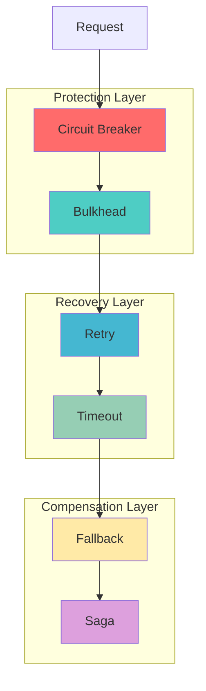

import { Grid } from 'nextra/components'
import { Card } from 'nextra/components'

# Enterprise Integration Patterns

**Complete Reference** • Fault Tolerance & Resilience

## Overview

JOTP implements **6 core enterprise integration patterns** for building resilient distributed systems. These patterns, proven in production environments, leverage JOTP's 15 OTP primitives to provide fault tolerance, graceful degradation, and data consistency across microservices.



## Pattern Categories

### Protection Patterns

Prevent cascading failures and resource exhaustion.

<Grid gap={4}>
  <Card>
    #### Circuit Breaker
    Fail-fast when services exceed crash thresholds
    → [Documentation](./circuit-breaker.mdx)
  </Card>
  <Card>
    #### Bulkhead
    Isolate resources per feature to prevent starvation
    → [Documentation](./bulkhead.mdx)
  </Card>
</Grid>

### Recovery Patterns

Handle transient failures with automatic retry and timeout enforcement.

<Grid gap={4}>
  <Card>
    #### Retry
    Exponential backoff with jitter for transient failures
    → [Documentation](./retry.mdx)
  </Card>
  <Card>
    #### Timeout
    Operation timeout enforcement for resource management
    → [Documentation](./timeout.mdx)
  </Card>
</Grid>

### Compensation Patterns

Graceful degradation and distributed transaction coordination.

<Grid gap={4}>
  <Card>
    #### Fallback
    Alternative execution paths for degraded service
    → [Documentation](./fallback.mdx)
  </Card>
  <Card>
    #### Saga
    Distributed transaction coordination with compensation
    → [Documentation](./saga.mdx)
  </Card>
</Grid>

## Quick Reference

| Pattern | Problem Solved | JOTP Primitive | Use Case |
|---------|---------------|----------------|----------|
| **Circuit Breaker** | Cascading failures | `Supervisor` | External service calls |
| **Bulkhead** | Resource starvation | `Proc<S,M>` + `Semaphore` | Feature isolation |
| **Retry** | Transient failures | `Proc<S,M>` | Network operations |
| **Timeout** | Hanging operations | `Proc.ask(Duration)` | All I/O operations |
| **Fallback** | Service unavailability | `Result<T,E>` | User-facing operations |
| **Saga** | Distributed consistency | `Proc<S,M>` + `StateMachine` | Multi-service workflows |

## When to Use Each Pattern

### Circuit Breaker

**Use when:**
- Calling external services that may fail
- Need to prevent cascading failures
- Want automatic fail-fast behavior
- Service has recovery time (not permanent failures)

**Don't use when:**
- Service is critical and must always be attempted
- Failures are permanent (use Retry instead)
- Need queue-based throttling (use Bulkhead)

### Bulkhead

**Use when:**
- Multiple features share resources
- Need to prevent noisy neighbor problem
- Want to guarantee resource availability
- Features have different priority levels

**Don't use when:**
- Only one feature uses the resource
- Need global rate limiting (use Rate Limiter)
- Resources are unlimited

### Retry

**Use when:**
- Failures are transient (network glitches)
- Service can recover quickly
- Operation is idempotent (or safe to retry)
- Have time to wait for recovery

**Don't use when:**
- Failures are permanent (4xx errors, validation)
- Operation is not idempotent
- Need immediate failure (use Circuit Breaker)
- Retry storms could overwhelm system

### Timeout

**Use when:**
- Operations have unpredictable duration
- Need to prevent resource exhaustion
- Want to provide responsive UX
- Operations involve I/O or network calls

**Don't use when:**
- Operations have known duration
- Can't safely interrupt operations
- Timeout is longer than acceptable latency

### Fallback

**Use when:**
- Have alternative data sources (cache, backup)
- Can provide degraded functionality
- Want to improve availability over correctness
- User experience is priority

**Don't use when:**
- Data consistency is critical
- No acceptable alternatives exist
- Fallback provides misleading information

### Saga

**Use when:**
- Coordinating transactions across services
- Need to maintain data consistency
- Can define compensating actions
- Operations are long-running

**Don't use when:**
- Single service transactions (use local ACID)
- Can't define compensating actions
- Need real-time consistency (use 2PC)
- Operations are simple and fast

## Pattern Combinations

### Standard Protection Stack

```
Request → Circuit Breaker → Bulkhead → Retry → Timeout → Service
```

**Most common combination for external service calls:**

```java
@Service
public class ResilientService {
    private final CircuitBreakerPattern circuitBreaker;
    private final BulkheadIsolationEnterprise bulkhead;
    private final EnterpriseRecovery retry;

    public Response execute(Request request) {
        // Layer 1: Circuit breaker (fail-fast)
        Result<Response> cbResult = circuitBreaker.execute(
            timeout -> {
                // Layer 2: Bulkhead (isolation)
                Result<Response> bhResult = bulkhead.execute(() -> {
                    // Layer 3: Retry (transient handling)
                    Result<Response> rtResult = retry.retry(() -> {
                        // Layer 4: Timeout (hanging prevention)
                        return externalApi.call(request, Duration.ofSeconds(3));
                    });
                    return rtResult.value();
                });
                return bhResult.value();
            },
            Duration.ofSeconds(10)
        );

        // Layer 5: Fallback (degradation)
        return switch (cbResult) {
            case Result.Success<Response>(Response r) -> r;
            case Result.Failure<CircuitBreakerException>(_) ->
                getFallbackResponse(request);
        };
    }
}
```

### High-Throughput Stack

```
Request → Bulkhead → Circuit Breaker → Service
```

**Optimized for throughput over protection:**

```java
// Fewer layers, higher thresholds
BulkheadConfig config = BulkheadConfig.builder("high-throughput")
    .limits(List.of(new ResourceLimit.MaxConcurrentRequests(1000)))
    .build();
```

### Strict Consistency Stack

```
Request → Circuit Breaker → Saga → Services
```

**For distributed transactions:**

```java
// Use saga for coordination, circuit breaker for each service
SagaConfig sagaConfig = new SagaConfig(
    "distributed-transaction",
    sagaId,
    List.of(
        new SagaStep.Action<>("service1", (input) ->
            circuitBreaker1.execute(timeout -> service1.call(input), timeout)
        ),
        new SagaStep.Action<>("service2", (input) ->
            circuitBreaker2.execute(timeout -> service2.call(input), timeout)
        )
    ),
    Duration.ofMinutes(10),
    true
);
```

## Configuration Best Practices

### Environment-Specific Thresholds

| Environment | Circuit Breaker | Bulkhead | Retry | Timeout |
|-------------|----------------|----------|-------|---------|
| **Production** | High thresholds, long recovery | High limits | 3-5 attempts | SLA-based |
| **Staging** | Medium thresholds | Medium limits | 3 attempts | Moderate |
| **Development** | Low thresholds (quick fail) | Low limits | 1-2 attempts | Short |
| **Testing** | Permissive or disabled | Disabled | 1 attempt | Minimal |

### Threshold Selection Formula

```java
// Circuit Breaker Failure Threshold
int calculateFailureThreshold(
    double acceptableErrorRate,      // e.g., 0.01 (1%)
    int requestsPerMinute,           // e.g., 1000
    int timeWindowMinutes            // e.g., 5
) {
    return (int) Math.ceil(
        acceptableErrorRate * requestsPerMinute * timeWindowMinutes
    );
}

// Example: 1% error rate, 1000 req/min, 5 min window
// Threshold = 0.01 * 1000 * 5 = 50 failures
```

## Monitoring & Observability

### Essential Metrics

All JOTP patterns emit Prometheus metrics:

```promql
# Circuit Breaker State
circuitbreaker_state{service="payment-api"}

# Bulkhead Utilization
bulkhead_utilization_percent{feature="order-processing"}

# Retry Attempts
retry_attempts_total{task="database-connection"}

# Timeout Rate
timeout_rate_total{operation="external-api"}

# Fallback Rate
fallback_rate_total{type="cache"}

# Saga Completion
saga_completed_total{saga_type="order-fulfillment"}
```

### Alert Thresholds

| Metric | Warning | Critical |
|--------|---------|----------|
| Circuit Breaker Open | > 1 | > 5 min |
| Bulkhead Utilization | > 80% | > 95% |
| Retry Rate | > 20% | > 50% |
| Timeout Rate | > 5% | > 10% |
| Fallback Rate | > 10% | > 25% |
| Saga Compensation | > 5% | > 10% |

## Migration Guide

### From Spring Resilience4j

```java
// Resilience4j
@CircuitBreaker(name = "backend")
@Bulkhead(name = "backend")
@Retry(name = "backend")
@TimeLimiter(name = "backend")
public String backendCall() {
    return backend.doSomething();
}

// JOTP (programmatic)
public String backendCall() {
    return circuitBreaker.execute(
        timeout -> bulkhead.execute(() ->
            retry.retry(() ->
                backend.doSomething()
            ).value()
        ).value(),
        Duration.ofSeconds(5)
    ).value();
}
```

### From Hystrix

```java
// Hystrix
@HystrixCommand(fallbackMethod = "fallback")
public String doSomething() {
    return riskyCall();
}

public String fallback() {
    return "default";
}

// JOTP
public String doSomething() {
    return circuitBreaker.execute(
        timeout -> riskyCall(),
        Duration.ofSeconds(3)
    ).recover(error -> "default").value();
}
```

## Performance Considerations

### Overhead Analysis

| Pattern | CPU Overhead | Memory Overhead | Latency Impact |
|---------|--------------|-----------------|----------------|
| Circuit Breaker | < 1% | ~1 KB per instance | < 1ms |
| Bulkhead | < 0.5% | ~100 B per request | < 0.5ms |
| Retry | Variable | ~500 B per attempt | Backoff time |
| Timeout | < 0.1% | Negligible | Timeout value |
| Fallback | < 1% | Cache size | Cache lookup |
| Saga | 1-2% | ~10 KB per saga | Coordination overhead |

### Optimization Tips

1. **Reuse pattern instances** across requests (don't create per-request)
2. **Use appropriate timeouts** (not too short/long)
3. **Monitor pattern metrics** to tune thresholds
4. **Combine patterns judiciously** (more layers = more overhead)
5. **Consider async execution** for non-blocking patterns

## References

### Implementation

All patterns are in `io.github.seanchatmangpt.jotp.enterprise.*`:

- `circuitbreaker.*` - Circuit breaker implementation
- `bulkhead.*` - Bulkhead isolation
- `recovery.*` - Retry with backoff
- `saga.*` - Distributed saga coordinator

### Related Documentation

- [Core Primitives](../primitives/overview.mdx) - Underlying OTP primitives
- [Supervision Trees](../../how-to/build-supervision-trees.mdx) - Hierarchical fault tolerance
- [Message Passing](../../how-to/send-receive-messages.mdx) - Async communication

### External Resources

- [Enterprise Integration Patterns](https://www.enterpriseintegrationpatterns.com/) - Original pattern catalog
- [Release It!](https://www.pragmaticprogrammer.com/titles/mnee2/release_it.html) - Michael Nygard
- [Microservices Patterns](https://microservices.io/patterns/) - Chris Richardson

---

## Pattern Deep Dives

- **[Circuit Breaker](./circuit-breaker.mdx)** - Prevent cascading failures
- **[Bulkhead](./bulkhead.mdx)** - Resource isolation
- **[Retry](./retry.mdx)** - Transient failure handling
- **[Timeout](./timeout.mdx)** - Operation time limits
- **[Fallback](./fallback.mdx)** - Graceful degradation
- **[Saga](./saga.mdx)** - Distributed transactions
