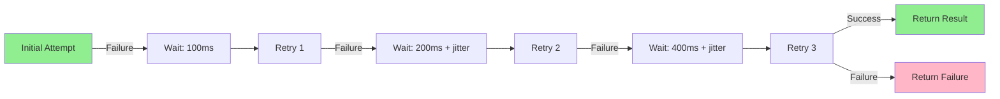
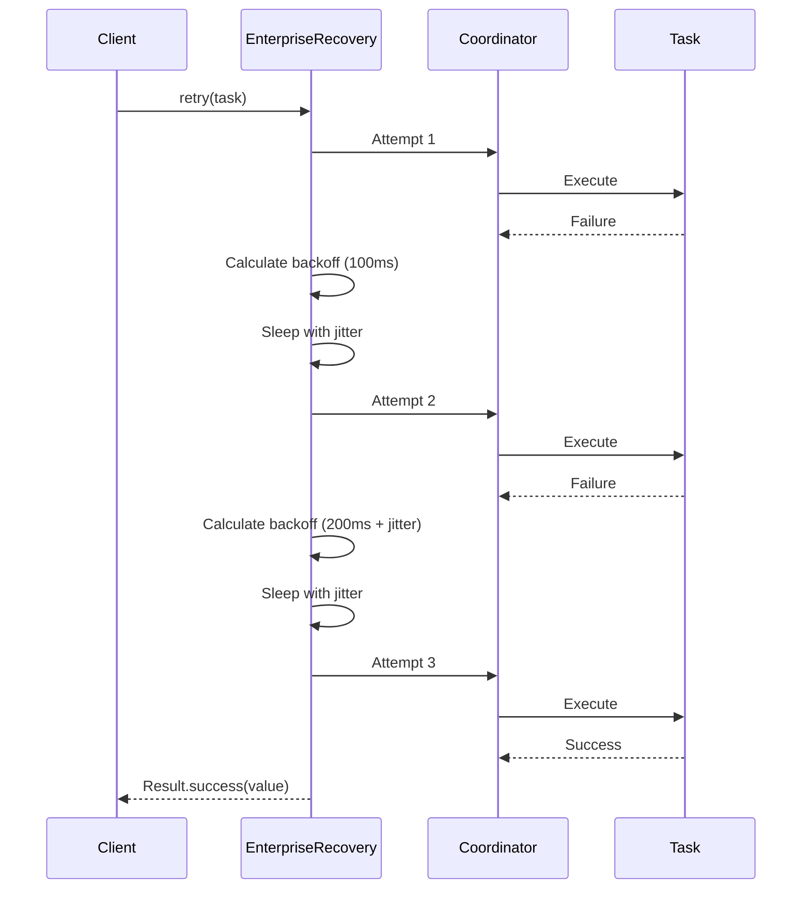

import { Tabs } from 'nextra/components'
import { Callout } from 'nextra/components'

# Retry Pattern

**Enterprise Integration Pattern** • Transient Failure Handling

## Overview

The **Retry** pattern handles transient failures by automatically retrying failed operations with increasing delays between attempts. JOTP's `EnterpriseRecovery` implements sophisticated backoff strategies with jitter to prevent thundering herd problems and provides circuit breaker integration for persistent failures.

<Callout type="info">
**JOTP Implementation**: Uses `Proc<S,M>` coordinator processes with exponential backoff, jitter, and fresh virtual thread per attempt (via CrashRecovery pattern).
</Callout>

## Problem Statement

Distributed systems experience transient failures:

- **Network glitches** - Temporary connectivity issues
- **Service unavailability** - Brief downtimes or restarts
- **Rate limiting** - HTTP 429 responses
- **Timeouts** - Intermittent slow responses

Simple retry can cause:
- **Thundering herd** - Many retries simultaneously overload the system
- **Resource waste** - Retrying immediately is futile
- **Cascading load** - Retry storms propagate upstream

## Solution

JOTP's `EnterpriseRecovery` implements intelligent retry with:



### Backoff Strategies

| Strategy | Description | Formula |
|----------|-------------|---------|
| **Exponential** | Delay doubles each retry | `delay = initial * (multiplier ^ attempt)` |
| **Linear** | Fixed increment per retry | `delay = initial + (increment * attempt)` |
| **Jittered** | Random variation to spread load | `delay = base * (1 ± jitterFactor)` |

## Configuration

### Basic Configuration

```java
RecoveryConfig config = RecoveryConfig.builder("database-connection")
    .maxAttempts(3)
    .initialDelay(Duration.ofMillis(100))
    .maxDelay(Duration.ofSeconds(5))
    .jitterFactor(0.1)
    .backoffMultiplier(2.0)
    .build();

EnterpriseRecovery retry = EnterpriseRecovery.create(config);
```

### Advanced Configuration

```java
RecoveryConfig config = RecoveryConfig.builder("external-api")
    .maxAttempts(5)
    .initialDelay(Duration.ofMillis(100))
    .maxDelay(Duration.ofMinutes(1))
    .jitterFactor(0.2)
    .backoffMultiplier(2.5)
    .circuitBreakerThreshold(5)
    .policy(new RetryPolicy.ExponentialBackoff())
    .metricsEnabled(true)
    .build();
```

### Configuration Parameters

<Tabs items={['Quick Recovery', 'Standard', 'Patient Retry']}>
<Tabs.Tab>
```java
RecoveryConfig.builder("cache-refresh")
    .maxAttempts(2)
    .initialDelay(Duration.ofMillis(50))
    .maxDelay(Duration.ofSeconds(1))
    .jitterFactor(0.1)
    .backoffMultiplier(2.0)
```
**Quick Recovery**: Fast retries for likely transient issues
</Tabs.Tab>
<Tabs.Tab>
```java
RecoveryConfig.builder("database-query")
    .maxAttempts(3)
    .initialDelay(Duration.ofMillis(100))
    .maxDelay(Duration.ofSeconds(10))
    .jitterFactor(0.15)
    .backoffMultiplier(2.0)
```
**Standard**: Balanced retry strategy for most operations
</Tabs.Tab>
<Tabs.Tab>
```java
RecoveryConfig.builder("external-api")
    .maxAttempts(5)
    .initialDelay(Duration.ofSeconds(1))
    .maxDelay(Duration.ofMinutes(2))
    .jitterFactor(0.25)
    .backoffMultiplier(2.0)
```
**Patient**: Many retries with long delays for resilient systems
</Tabs.Tab>
</Tabs>

## Usage Examples

### Basic Pattern

```java
// Create retry coordinator
RecoveryConfig config = RecoveryConfig.builder("api-call")
    .maxAttempts(3)
    .initialDelay(Duration.ofMillis(100))
    .maxDelay(Duration.ofSeconds(5))
    .build();
EnterpriseRecovery retry = EnterpriseRecovery.create(config);

// Execute task with retry
Result<String> result = retry.retry(() -> {
    // Your potentially failing operation
    return externalApiClient.fetchData();
});

// Handle result
switch (result) {
    case Result.Success<String>(String value) -> {
        System.out.println("Success after retries: " + value);
    }
    case Result.Failure<RecoveryException>(RecoveryException e) -> {
        System.err.println("All retries failed: " + e.getMessage());
    }
}
```

### Spring Boot Integration

```java
@Service
public class PaymentService {
    private final EnterpriseRecovery retry;

    public PaymentService() {
        RecoveryConfig config = RecoveryConfig.builder("payment-gateway")
            .maxAttempts(3)
            .initialDelay(Duration.ofMillis(200))
            .maxDelay(Duration.ofSeconds(10))
            .jitterFactor(0.2)
            .backoffMultiplier(2.0)
            .policy(new RetryPolicy.ExponentialBackoff())
            .build();
        this.retry = EnterpriseRecovery.create(config);
    }

    public PaymentResult processPayment(PaymentRequest request) {
        Result<PaymentResult> result = retry.retry(() -> {
            return paymentGateway.charge(request);
        });

        return switch (result) {
            case Result.Success<PaymentResult>(PaymentResult r) -> r;
            case Result.Failure<RecoveryException>(_) ->
                PaymentResult.failed("Payment service unavailable");
        };
    }

    @PreDestroy
    public void shutdown() {
        retry.shutdown();
    }
}
```

### Retry with Circuit Breaker

```java
// Combine retry with circuit breaker
@Service
public class ResilientService {
    private final EnterpriseRecovery retry;
    private final CircuitBreakerPattern circuitBreaker;

    public ResilientService() {
        RecoveryConfig retryConfig = RecoveryConfig.builder("api-call")
            .maxAttempts(3)
            .initialDelay(Duration.ofMillis(100))
            .maxDelay(Duration.ofSeconds(5))
            .circuitBreakerThreshold(5)  // Trip after 5 consecutive failures
            .build();

        CircuitBreakerConfig cbConfig = CircuitBreakerConfig.of("external-api");

        this.retry = EnterpriseRecovery.create(retryConfig);
        this.circuitBreaker = CircuitBreakerPattern.create(cbConfig);
    }

    public String fetchData() {
        // First level: Circuit breaker
        Result<String> cbResult = circuitBreaker.execute(
            timeout -> {
                // Second level: Retry
                Result<String> retryResult = retry.retry(() -> {
                    return externalApiClient.call();
                });

                if (retryResult instanceof Result.Success<String>(String s)) {
                    return s;
                } else {
                    throw new RuntimeException("Retry failed");
                }
            },
            Duration.ofSeconds(10)
        );

        return switch (cbResult) {
            case Result.Success<String>(String s) -> s;
            case Result.Failure<CircuitBreakerException>(_) ->
                getCachedData();  // Fallback
        };
    }
}
```

### Conditional Retry

```java
// Retry only on specific exceptions
Result<String> result = retry.retry(() -> {
    try {
        return externalApiClient.call();
    } catch (HttpClientErrorException e) {
        // Don't retry on client errors (4xx)
        if (e.getStatusCode().is4xxClientError()) {
            throw new RuntimeException("Non-retryable", e);
        }
        // Retry on server errors (5xx)
        throw e;
    }
});
```

## Sequence Diagram



## Backoff Calculation

### Exponential Backoff with Jitter

```java
// Formula:
// delay = min(initial * (multiplier ^ (attempt-1)), max) * (1 ± jitter)

// Example attempts:
// Attempt 1: 100ms * (1 ± 0.1) = 90-110ms
// Attempt 2: 200ms * (1 ± 0.1) = 180-220ms
// Attempt 3: 400ms * (1 ± 0.1) = 360-440ms
// Attempt 4: 800ms * (1 ± 0.1) = 720-880ms
// Attempt 5: 1600ms * (1 ± 0.1) = 1440-1760ms
// Capped at maxDelay (e.g., 5000ms)
```

### Jitter Benefits

- **Prevents thundering herd** - Spreads retry attempts over time
- **Reduces contention** - Avoids synchronized retry storms
- **Better success rate** - Less competition for resources

## Monitoring & Metrics

### Key Metrics

| Metric | Description | Alert Threshold |
|--------|-------------|-----------------|
| **Retry Rate** | % of operations that retry | > 20% = Warning |
| **Attempt Distribution** | Histogram of attempt numbers | Skewed toward high = Issue |
| **Backoff Time** | Total time spent in backoff | > 30s = Degraded |
| **Success after Retry** | % of retries that eventually succeed | < 50% = Critical |

### Micrometer Integration

```java
@Autowired
private MeterRegistry registry;

public void setupRetryMetrics(EnterpriseRecovery retry) {
    retry.addListener((attemptNumber, delay) -> {
        registry.counter("retry.attempts",
            "task", retry.getConfig().taskName(),
            "attempt", String.valueOf(attemptNumber)
        ).increment();

        registry.timer("retry.backoff",
            "task", retry.getConfig().taskName()
        ).record(delay);
    });
}
```

### Prometheus Queries

```promql
# Retry rate by task
rate(retry_attempts_total[5m])

# Average attempts per operation
avg(retry_attempt_number) by (task)

# Time spent in backoff
rate(retry_backoff_seconds_sum[5m])

# Success after retry rate
rate(retry_success_total[5m]) / rate(retry_attempts_total[5m])
```

## Production Tuning

### Max Attempts Selection

```java
// Based on acceptable latency and transient failure duration
Duration maxAcceptableLatency = Duration.ofSeconds(5);
Duration typicalTransientDuration = Duration.ofSeconds(1);

// Calculate: How many retries fit in max latency?
int maxAttempts = (int) (maxAcceptableLatency.toSeconds() /
                        typicalTransientDuration.toSeconds());

RecoveryConfig.builder("api-call")
    .maxAttempts(maxAttempts)
    .initialDelay(Duration.ofMillis(100))
    .backoffMultiplier(2.0)
    .build();
```

### Jitter Factor Tuning

```java
// Higher jitter for larger systems
int systemSize = 1000;  // Number of concurrent processes
double jitterFactor = Math.min(0.5, 0.1 + (systemSize / 10000.0));

RecoveryConfig.builder("distributed-task")
    .jitterFactor(jitterFactor)
    .build();
```

### Policy Selection

```java
// Custom retry policy
public class RateLimitRetryPolicy extends RetryPolicy {
    @Override
    public boolean shouldRetry(Exception e, int attemptNumber) {
        // Retry only on rate limits
        return e instanceof RateLimitExceededException;
    }

    @Override
    public Duration calculateBackoff(int attemptNumber) {
        // Use exponential backoff for rate limits
        return Duration.ofMillis(100L * (long) Math.pow(2, attemptNumber));
    }
}

RecoveryConfig.builder("rate-limited-api")
    .policy(new RateLimitRetryPolicy())
    .build();
```

## Best Practices

<Callout type="success">
**DO** ✓
- Always set maxDelay to prevent excessive waits
- Use jitter (0.1-0.3) to prevent thundering herd
- Combine with circuit breaker for persistent failures
- Monitor retry rates to identify systemic issues
- Add logging for retry attempts with context
- Use different policies for different error types
</Callup>

<Callout type="error">
**DON'T** ✗
- Retry indefinitely without maxAttempts
- Retry on non-transient errors (4xx, validation)
- Set initialDelay too low (thundering herd)
- Forget to shutdown retry coordinators
- Ignore retry metrics (indicates service health)
- Retry without jitter in distributed systems
</Callout>

## Testing

```java
@Test
public void testRetrySucceedsOnSecondAttempt() {
    AtomicInteger attempts = new AtomicInteger(0);

    RecoveryConfig config = RecoveryConfig.builder("test")
        .maxAttempts(3)
        .initialDelay(Duration.ofMillis(10))
        .build();
    EnterpriseRecovery retry = EnterpriseRecovery.create(config);

    Result<String> result = retry.retry(() -> {
        int attempt = attempts.incrementAndGet();
        if (attempt == 1) {
            throw new RuntimeException("First attempt fails");
        }
        return "Success";
    });

    assertTrue(result instanceof Result.Success);
    assertEquals("Success", result.value());
    assertEquals(2, attempts.get());
}

@Test
public void testRetryFailsAfterMaxAttempts() {
    RecoveryConfig config = RecoveryConfig.builder("test")
        .maxAttempts(2)
        .initialDelay(Duration.ofMillis(10))
        .build();
    EnterpriseRecovery retry = EnterpriseRecovery.create(config);

    Result<String> result = retry.retry(() -> {
        throw new RuntimeException("Always fails");
    });

    assertTrue(result instanceof Result.Failure);
    assertTrue(result.error().getMessage().contains("Max attempts exceeded"));
}
```

## References

- **Implementation**: `io.github.seanchatmangpt.jotp.enterprise.recovery.EnterpriseRecovery`
- **Configuration**: `io.github.seanchatmangpt.jotp.enterprise.recovery.RecoveryConfig`
- **Related Patterns**: [Circuit Breaker](./circuit-breaker.mdx), [Timeout](./timeout.mdx)
- **Original Pattern**: [Retry (Microsoft)](https://docs.microsoft.com/en-us/azure/architecture/patterns/retry)

---

**Next**: [Timeout Pattern](./timeout.mdx) • **Previous**: [Bulkhead](./bulkhead.mdx)
