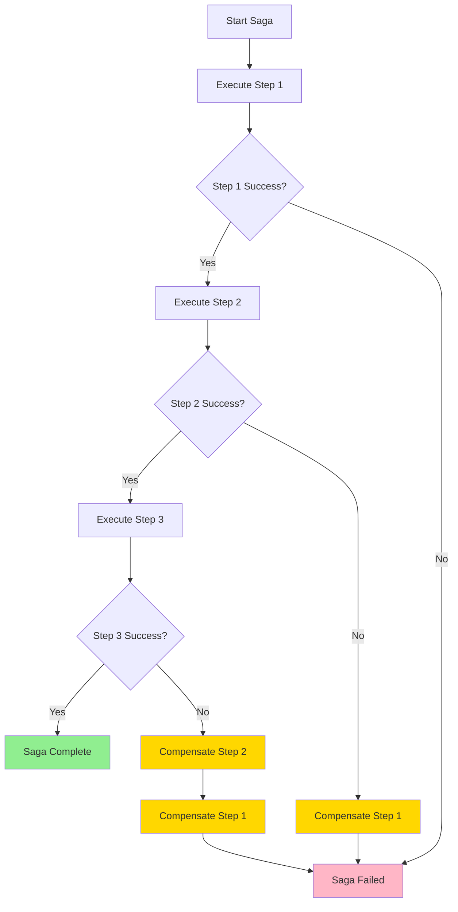
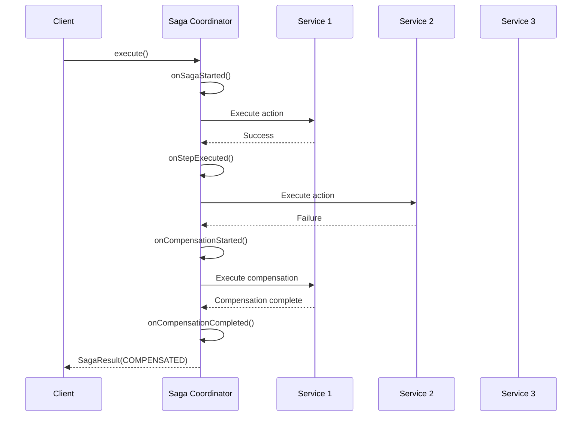

import { Tabs } from 'nextra/components'
import { Callout } from 'nextra/components'

# Saga Pattern

**Enterprise Integration Pattern** • Distributed Transaction Coordination

## Overview

The **Saga** pattern manages distributed transactions across multiple services by executing a sequence of local transactions and providing compensating actions to rollback changes when failures occur. JOTP's `DistributedSagaCoordinator` implements choreography-based sagas with process-based state management and event-driven compensation.

<Callout type="info">
**JOTP Implementation**: Uses `Proc<S,M>` for saga state management, `CompletableFuture` for async execution, and event-driven compensation with `SagaListener` callbacks.
</Callout>

## Problem Statement

Distributed transactions face challenges:

- **No ACID across services** - Can't use distributed transactions (2PC)
- **Partial failures** - Some services succeed, others fail
- **Data inconsistency** - Orphaned records across services
- **Complex rollback** - Need to undo committed changes

## Solution

JOTP's saga pattern implements two-phase execution:



### Saga Types

| Type | Description | Use Case |
|------|-------------|----------|
| **Choreography** - Events trigger next step | Simple, decoupled workflows |
| **Orchestration** | Central coordinator manages flow | Complex, multi-step transactions |

## Configuration

### Basic Saga Definition

```java
// Define saga steps
List<SagaStep> steps = List.of(
    new SagaStep.Action<>(
        "reserve-inventory",
        (input) -> inventoryService.reserve(orderId, items)
    ),
    new SagaStep.Action<>(
        "process-payment",
        (input) -> paymentService.charge(userId, amount)
    ),
    new SagaStep.Action<>(
        "confirm-order",
        (input) -> orderService.confirm(orderId)
    )
);

// Add compensating actions
List<SagaStep> compensatedSteps = List.of(
    steps.get(0),  // reserve-inventory
    new SagaStep.Compensation<>(
        "release-inventory",
        (output) -> inventoryService.release(orderId, items)
    ),
    steps.get(1),  // process-payment
    new SagaStep.Compensation<>(
        "refund-payment",
        (output) -> paymentService.refund(transactionId)
    ),
    steps.get(2)   // confirm-order (no compensation needed)
);
```

### Saga Configuration

```java
SagaConfig config = new SagaConfig(
    "order-fulfillment",
    UUID.randomUUID().toString(),
    List.of(
        new SagaStep.Action<>("step1", task1),
        new SagaStep.Action<>("step2", task2),
        new SagaStep.Action<>("step3", task3)
    ),
    Duration.ofMinutes(5),  // Timeout
    true  // Enable metrics
);
```

### Configuration Parameters

<Tabs items=['Fast Saga', 'Standard Saga', 'Long-Running Saga']}>
<Tabs.Tab>
```java
new SagaConfig(
    "simple-payment",
    sagaId,
    List.of(step1, step2),
    Duration.ofSeconds(10),
    true
)
```
**Fast Saga**: Quick operations, tight timeout
</Tabs.Tab>
<Tabs.Tab>
```java
new SagaConfig(
    "order-processing",
    sagaId,
    List.of(inventory, payment, shipping, notification),
    Duration.ofMinutes(5),
    true
)
```
**Standard Saga**: Typical business process
</Tabs.Tab>
<Tabs.Tab>
```java
new SagaConfig(
    "enterprise-workflow",
    sagaId,
    List.of(approval, procurement, fulfillment, settlement),
    Duration.ofHours(24),
    true
)
```
**Long-Running**: Complex multi-day workflows
</Tabs.Tab>
</Tabs>

## Usage Examples

### Basic Saga Pattern

```java
@Service
public class OrderService {
    private final DistributedSagaCoordinator sagaCoordinator;

    public OrderResult processOrder(OrderRequest request) {
        // Define saga steps
        List<SagaStep> steps = List.of(
            new SagaStep.Action<>(
                "reserve-inventory",
                (input) -> {
                    return inventoryService.reserve(
                        request.getOrderId(),
                        request.getItems()
                    );
                }
            ),
            new SagaStep.Compensation<>(
                "release-inventory",
                (output) -> {
                    inventoryService.release(
                        request.getOrderId(),
                        request.getItems()
                    );
                }
            ),
            new SagaStep.Action<>(
                "process-payment",
                (input) -> {
                    return paymentService.charge(
                        request.getUserId(),
                        request.getAmount()
                    );
                }
            ),
            new SagaStep.Compensation<>(
                "refund-payment",
                (output) -> {
                    paymentService.refund(
                        output.getTransactionId()
                    );
                }
            ),
            new SagaStep.Action<>(
                "confirm-order",
                (input) -> {
                    return orderService.confirm(request.getOrderId());
                }
            )
        );

        // Create and execute saga
        SagaConfig config = new SagaConfig(
            "order-processing",
            UUID.randomUUID().toString(),
            steps,
            Duration.ofMinutes(5),
            true
        );

        sagaCoordinator = DistributedSagaCoordinator.create(config);

        // Execute saga asynchronously
        CompletableFuture<SagaResult> future = sagaCoordinator.execute();

        // Handle result
        future.thenAccept(result -> {
            switch (result.status()) {
                case COMPLETED -> {
                    logger.info("Order processed successfully: {}", result.sagaId());
                    orderService.markCompleted(result.sagaId());
                }
                case COMPENSATED -> {
                    logger.warn("Order compensated: {}", result.errorMessage());
                    orderService.markFailed(result.sagaId());
                }
                case FAILED -> {
                    logger.error("Saga failed: {}", result.errorMessage());
                    orderService.markFailed(result.sagaId());
                }
            }
        });

        return OrderResult.processing(future);
    }
}
```

### Spring Boot Integration

```java
@Service
public class TripBookingService {
    private final DistributedSagaCoordinator sagaCoordinator;
    private final Map<String, SagaConfig> sagaTemplates;

    @PostConstruct
    public void init() {
        // Define saga template
        sagaTemplates.put("book-trip", createTripBookingSaga());
    }

    public BookingResult bookTrip(TripRequest request) {
        SagaConfig config = sagaTemplates.get("book-trip")
            .withSagaId(UUID.randomUUID().toString());

        DistributedSagaCoordinator saga = DistributedSagaCoordinator.create(config);

        // Add listener for monitoring
        saga.addListener(new SagaListener() {
            @Override
            public void onSagaStarted(String sagaId, int stepCount) {
                logger.info("Trip booking started: {} steps", stepCount);
                metricsService.counter("saga.started", "type", "book-trip").increment();
            }

            @Override
            public void onStepExecuted(String sagaId, String stepName, Object output) {
                logger.info("Step completed: {}", stepName);
            }

            @Override
            public void onCompensationStarted(String sagaId, int fromStep) {
                logger.warn("Compensation started from step: {}", fromStep);
                metricsService.counter("saga.compensation", "type", "book-trip").increment();
            }

            @Override
            public void onCompensationCompleted(String sagaId) {
                logger.warn("Trip booking compensated: {}", sagaId);
            }

            @Override
            public void onSagaCompleted(String sagaId, long durationMs) {
                logger.info("Trip booking completed in {}ms", durationMs);
                metricsService.timer("saga.duration", "type", "book-trip").record(durationMs, TimeUnit.MILLISECONDS);
            }

            @Override
            public void onSagaAborted(String sagaId, String reason) {
                logger.error("Trip booking aborted: {}", reason);
            }
        });

        CompletableFuture<SagaResult> future = saga.execute();
        return BookingResult.async(future);
    }

    private SagaConfig createTripBookingSaga() {
        return new SagaConfig(
            "book-trip",
            "${sagaId}",  // Template variable
            List.of(
                new SagaStep.Action<>(
                    "reserve-flight",
                    (input) -> flightService.reserve(input.getFlightId())
                ),
                new SagaStep.Compensation<>(
                    "cancel-flight",
                    (output) -> flightService.cancel(output.getBookingRef())
                ),
                new SagaStep.Action<>(
                    "reserve-hotel",
                    (input) -> hotelService.reserve(input.getHotelId())
                ),
                new SagaStep.Compensation<>(
                    "cancel-hotel",
                    (output) -> hotelService.cancel(output.getConfirmationNumber())
                ),
                new SagaStep.Action<>(
                    "reserve-car",
                    (input) -> carService.reserve(input.getCarType())
                ),
                new SagaStep.Compensation<>(
                    "cancel-car",
                    (output) -> carService.cancel(output.getRentalId())
                ),
                new SagaStep.Action<>(
                    "confirm-booking",
                    (input) -> bookingService.confirm(input.getTripId())
                )
            ),
            Duration.ofMinutes(10),
            true
        );
    }
}
```

### Saga with Timeout

```java
public class TimeoutSagaExample {
    public void executeSagaWithTimeout() {
        SagaConfig config = new SagaConfig(
            "timeout-saga",
            UUID.randomUUID().toString(),
            getSteps(),
            Duration.ofSeconds(30),  // Overall timeout
            true
        );

        DistributedSagaCoordinator saga = DistributedSagaCoordinator.create(config);
        CompletableFuture<SagaResult> future = saga.execute();

        // Add timeout handling
        future.orTimeout(30, TimeUnit.SECONDS)
            .exceptionally(ex -> {
                if (ex instanceof TimeoutException) {
                    logger.error("Saga timed out, aborting");
                    saga.abort(config.sagaId(), "Timeout");
                }
                return new SagaResult(
                    config.sagaId(),
                    SagaResult.Status.ABORTED,
                    "Timeout",
                    Map.of()
                );
            });
    }
}
```

### Conditional Saga Steps

```java
public class ConditionalSaga {
    private SagaStep createConditionalStep(
        String name,
        Function<Void, Object> action,
        Predicate<Void> condition
    ) {
        return new SagaStep.Action<>(name, (input) -> {
            if (condition.test(input)) {
                return action.apply(input);
            } else {
                logger.info("Skipping step: {}", name);
                return null;  // Skip this step
            }
        });
    }

    public SagaConfig createConditionalSaga(OrderRequest request) {
        return new SagaConfig(
            "conditional-order",
            UUID.randomUUID().toString(),
            List.of(
                new SagaStep.Action<>("validate", (input) -> validate(request)),
                createConditionalStep(
                    "premium-upgrade",
                    (input) -> upgradeService.applyPremium(request),
                    (input) -> request.isPremiumUser()
                ),
                new SagaStep.Action<>("inventory", (input) -> reserve(request)),
                new SagaStep.Action<>("payment", (input) -> charge(request))
            ),
            Duration.ofMinutes(5),
            true
        );
    }
}
```

## Sequence Diagram



## Monitoring & Metrics

### Key Metrics

| Metric | Description | Alert Threshold |
|--------|-------------|-----------------|
| **Saga Completion Rate** | % of sagas completing successfully | < 95% = Warning |
| **Compensation Rate** | % of sagas requiring compensation | > 5% = Issue |
| **Step Duration** | Time per step (P95) | > SLA = Critical |
| **Saga Duration** | End-to-end saga time | > Timeout = Failure |

### Micrometer Integration

```java
@Component
public class SagaMetrics {
    private final MeterRegistry registry;

    public SagaMetrics(MeterRegistry registry) {
        this.registry = registry;
    }

    public void setupMetrics(DistributedSagaCoordinator saga) {
        saga.addListener(new SagaListener() {
            @Override
            public void onSagaStarted(String sagaId, int stepCount) {
                registry.counter("saga.started",
                    "saga_type", saga.getConfig().sagaId()
                ).increment();
            }

            @Override
            public void onStepExecuted(String sagaId, String stepName, Object output) {
                registry.counter("saga.step.completed",
                    "saga_type", saga.getConfig().sagaId(),
                    "step", stepName
                ).increment();
            }

            @Override
            public void onCompensationStarted(String sagaId, int fromStep) {
                registry.counter("saga.compensation.started",
                    "saga_type", saga.getConfig().sagaId()
                ).increment();
            }

            @Override
            public void onSagaCompleted(String sagaId, long durationMs) {
                registry.timer("saga.duration",
                    "saga_type", saga.getConfig().sagaId()
                ).record(durationMs, TimeUnit.MILLISECONDS);
            }
        });
    }
}
```

### Prometheus Queries

```promql
# Saga completion rate
rate(saga_completed_total[5m]) / rate(saga_started_total[5m])

# Compensation rate
rate(saga_compensation_started_total[5m]) / rate(saga_started_total[5m])

# P95 saga duration
histogram_quantile(0.95, saga_duration_seconds)

# Step failure rate
rate(saga_step_failed_total[5m]) by (step)
```

## Production Tuning

### Saga Timeout Calculation

```java
// Calculate timeout based on step SLAs
public class TimeoutCalculator {
    public Duration calculateSagaTimeout(List<SagaStep> steps) {
        long totalTimeoutMs = steps.stream()
            .mapToLong(step -> {
                // Get SLA for each step
                Duration stepSla = getStepSLA(step.name());
                // Add buffer for compensation
                return stepSla.multipliedBy(3).toMillis();
            })
            .sum();

        return Duration.ofMillis(totalTimeoutMs);
    }
}
```

### Retry Integration

```java
public class SagaWithRetry {
    private SagaStep createStepWithRetry(
        String name,
        Function<Void, Object> action
    ) {
        return new SagaStep.Action<>(name, (input) -> {
            RecoveryConfig config = RecoveryConfig.builder(name)
                .maxAttempts(3)
                .initialDelay(Duration.ofMillis(100))
                .build();

            EnterpriseRecovery retry = EnterpriseRecovery.create(config);
            Result<Object> result = retry.retry(() -> action.apply(input));

            if (result instanceof Result.Success<Object>(Object value)) {
                return value;
            } else {
                throw new SagaStepException("Step failed after retries");
            }
        });
    }
}
```

### Saga Persistence

```java
@Service
public class PersistentSagaCoordinator {
    private final SagaRepository sagaRepository;
    private final DistributedSagaCoordinator sagaCoordinator;

    public void executePersistentSaga(SagaConfig config) {
        // Save saga state to database
        SagaState state = new SagaState(
            config.sagaId(),
            SagaStatus.STARTED,
            new ArrayList<>()
        );
        sagaRepository.save(state);

        sagaCoordinator.addListener(new SagaListener() {
            @Override
            public void onStepExecuted(String sagaId, String stepName, Object output) {
                // Update state after each step
                SagaState current = sagaRepository.findById(sagaId);
                current.addStep(new CompletedStep(stepName, output));
                sagaRepository.save(current);
            }

            @Override
            public void onSagaCompleted(String sagaId, long durationMs) {
                SagaState current = sagaRepository.findById(sagaId);
                current.setStatus(SagaStatus.COMPLETED);
                sagaRepository.save(current);
            }
        });

        sagaCoordinator.execute();
    }
}
```

## Best Practices

<Callout type="success">
**DO** ✓
- Define compensating actions for all steps
- Make compensating actions idempotent
- Use timeouts at both saga and step level
- Monitor compensation rates (high = issues)
- Log saga execution with correlation IDs
- Test sagas with step failures
- Use event sourcing for saga audit trails
</Callout>

<Callout type="error">
**DON'T** ✗
- Forget compensating actions (data inconsistency)
- Make compensations fail silently (orphaned data)
- Set timeouts too short (incomplete sagas)
- Ignore saga failures (business impact)
- Use sagas for single-service transactions (use local transactions)
- Mix sagas with distributed transactions (2PC)
</Callout>

## Testing

```java
@Test
public void testSagaCompensatesOnFailure() {
    List<SagaStep> steps = List.of(
        new SagaStep.Action<>("step1", (input) -> {
            return "step1-result";
        }),
        new SagaStep.Action<>("step2", (input) -> {
            throw new RuntimeException("Step 2 fails");
        }),
        new SagaStep.Action<>("step3", (input) -> {
            return "step3-result";
        })
    );

    SagaConfig config = new SagaConfig(
        "test-saga",
        UUID.randomUUID().toString(),
        steps,
        Duration.ofMinutes(5),
        true
    );

    DistributedSagaCoordinator saga = DistributedSagaCoordinator.create(config);
    CompletableFuture<SagaResult> future = saga.execute();

    SagaResult result = future.join();
    assertEquals(SagaResult.Status.COMPENSATED, result.status());
}

@Test
public void testSagaCompletesSuccessfully() {
    // Create saga with all steps succeeding
    SagaConfig config = new SagaConfig(
        "test-saga",
        UUID.randomUUID().toString(),
        List.of(
            new SagaStep.Action<>("step1", (input) -> "result1"),
            new SagaStep.Action<>("step2", (input) -> "result2"),
            new SagaStep.Action<>("step3", (input) -> "result3")
        ),
        Duration.ofMinutes(5),
        true
    );

    DistributedSagaCoordinator saga = DistributedSagaCoordinator.create(config);
    CompletableFuture<SagaResult> future = saga.execute();

    SagaResult result = future.join();
    assertEquals(SagaResult.Status.COMPLETED, result.status());
}
```

## References

- **Implementation**: `io.github.seanchatmangpt.jotp.enterprise.saga.DistributedSagaCoordinator`
- **Configuration**: `io.github.seanchatmangpt.jotp.enterprise.saga.SagaConfig`
- **Related Patterns**: [Circuit Breaker](./circuit-breaker.mdx), [Retry](./retry.mdx), [Fallback](./fallback.mdx)
- **Original Pattern**: [Saga (Microservices Patterns)](https://microservices.io/patterns/data/saga.html)

---

**Next**: [Enterprise Patterns Overview](./index.mdx) • **Previous**: [Fallback](./fallback.mdx)
