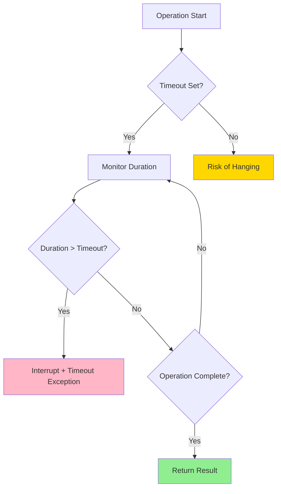
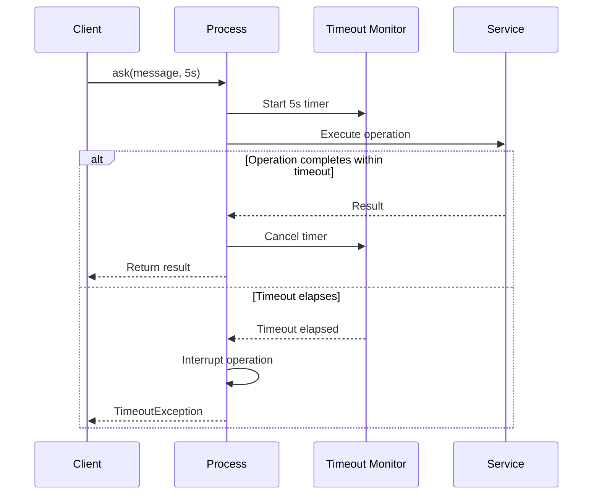

import { Tabs } from 'nextra/components'
import { Callout } from 'nextra/components'

# Timeout Pattern

**Enterprise Integration Pattern** • Operation Timeout Handling

## Overview

The **Timeout** pattern prevents operations from blocking indefinitely by enforcing maximum execution times. JOTP integrates timeout handling through `Proc.ask()` with `Duration` parameters, virtual thread interruption, and `ProcTimer` for scheduled message delivery.

<Callout type="info">
**JOTP Implementation**: Uses Java 26's virtual thread interruption, `Proc.ask(Duration timeout)` for request-reply, and `ProcTimer` for scheduled timeouts.
</Callout>

## Problem Statement

Without timeout enforcement:

- **Resource exhaustion** - Threads/memory tied up indefinitely
- **Cascading delays** - Slow operations propagate upstream
- **User frustration** - Requests never complete
- **Deadlock scenarios** - Operations waiting forever

## Solution

JOTP provides multiple timeout mechanisms:



### Timeout Mechanisms

| Mechanism | Use Case | JOTP Primitive |
|-----------|----------|----------------|
| **ask(timeout)** | Request-reply with timeout | `Proc.ask(message, Duration)` |
| **ProcTimer** | Scheduled message delivery | `ProcTimer.sendAfter()` |
| **Virtual Thread Interrupt** | Long-running tasks | `Thread.interrupt()` |
| **Future Timeout** | Async operations | `CompletableFuture.get(timeout)` |

## Configuration

### Basic Timeout

```java
// Request with timeout
Proc<String, String> proc = Proc.start(
    state -> msg -> {
        Thread.sleep(5000);  // Simulate slow operation
        return "Done";
    },
    "initial"
);

// Set timeout to 1 second
try {
    String result = proc.ask(
        msg -> "Request",
        Duration.ofSeconds(1)
    );
} catch (TimeoutException e) {
    System.err.println("Operation timed out");
}
```

### Scheduled Timeout with ProcTimer

```java
// Send message after timeout
ProcRef<String, String> procRef = new ProcRef<>(proc);

// Schedule timeout message
ProcTimer.sendAfter(
    Duration.ofSeconds(5),
    procRef,
    new TimeoutMessage("Operation timed out")
);
```

### Timeout Configuration

<Tabs items={['Aggressive', 'Balanced', 'Lenient']}>
<Tabs.Tab>
```java
// Fast failure, quick feedback
Duration timeout = Duration.ofMillis(500);

// Use for: User-facing operations, API calls
```
**Aggressive**: 500ms-2s, prioritize user experience
</Tabs.Tab>
<Tabs.Tab>
```java
// Reasonable timeout, balanced approach
Duration timeout = Duration.ofSeconds(5);

// Use for: Database queries, internal services
```
**Balanced**: 2s-10s, standard operations
</Tabs.Tab>
<Tabs.Tab>
```java
// Patient timeout, allow processing time
Duration timeout = Duration.ofSeconds(30);

// Use for: Batch jobs, file processing, reporting
```
**Lenient**: 10s-300s, heavy computations
</Tabs.Tab>
</Tabs>

## Usage Examples

### Basic Pattern with Proc.ask()

```java
@Service
public class UserService {
    private final ProcRef<UserState, UserMessage> userProc;

    public User getUser(String userId) {
        try {
            // Request with 2-second timeout
            User user = userProc.ask(
                new UserMessage.GetUser(userId),
                Duration.ofSeconds(2)
            );
            return user;
        } catch (TimeoutException e) {
            // Handle timeout
            logger.error("User lookup timed out for: {}", userId);
            return User.notFound();
        }
    }
}
```

### Spring Boot Integration

```java
@Service
public class PaymentService {
    private final ProcRef<PaymentState, PaymentMessage> paymentProc;
    private final Duration defaultTimeout = Duration.ofSeconds(5);

    public PaymentResult processPayment(PaymentRequest request) {
        try {
            return paymentProc.ask(
                new PaymentMessage.ProcessPayment(request),
                calculateTimeout(request.getAmount())
            );
        } catch (TimeoutException e) {
            logger.warn("Payment processing timed out for order: {}",
                       request.getOrderId());

            // Check payment status asynchronously
            CompletableFuture.supplyAsync(() -> checkPaymentStatus(request.getOrderId()));

            return PaymentResult.timedOut();
        }
    }

    private Duration calculateTimeout(BigDecimal amount) {
        // Larger amounts get longer timeout
        if (amount.compareTo(new BigDecimal("1000")) > 0) {
            return Duration.ofSeconds(10);
        }
        return defaultTimeout;
    }
}
```

### Timeout with Fallback

```java
public class ResilientService {
    private final ProcRef<ServiceState, ServiceMessage> serviceProc;
    private final Cache<String, Response> cache;

    public Response fetchData(String key) {
        try {
            // Try fresh data with timeout
            return serviceProc.ask(
                new ServiceMessage.Fetch(key),
                Duration.ofSeconds(2)
            );
        } catch (TimeoutException e) {
            // Fallback to cache
            Response cached = cache.getIfPresent(key);
            if (cached != null) {
                logger.info("Using cached data for: {}", key);
                return cached;
            }

            // Final fallback
            return Response.stale();
        }
    }
}
```

### Cascading Timeouts

```java
// Set timeouts at each layer
public class LayeredService {
    // Layer 1: API Gateway (shortest timeout)
    public Response handleRequest(Request req) {
        return executeWithTimeout(
            () -> businessLayer.process(req),
            Duration.ofSeconds(3)
        );
    }

    // Layer 2: Business Logic (medium timeout)
    public Response process(Request req) {
        return executeWithTimeout(
            () -> dataLayer.fetch(req.getId()),
            Duration.ofSeconds(5)
        );
    }

    // Layer 3: Data Layer (longest timeout)
    public Data fetch(String id) {
        return executeWithTimeout(
            () -> database.query(id),
            Duration.ofSeconds(10)
        );
    }

    private <T> T executeWithTimeout(Supplier<T> task, Duration timeout) {
        CompletableFuture<T> future = CompletableFuture.supplyAsync(task);
        try {
            return future.get(timeout.toMillis(), TimeUnit.MILLISECONDS);
        } catch (TimeoutException e) {
            future.cancel(true);  // Interrupt
            throw new RuntimeException("Operation timed out", e);
        }
    }
}
```

## Sequence Diagram



## Timeout Strategies

### Fixed Timeout

```java
// Simple, predictable
Duration timeout = Duration.ofSeconds(5);
result = proc.ask(message, timeout);
```

### Adaptive Timeout

```java
// Adjust based on recent performance
public class AdaptiveTimeout {
    private final AtomicReference<Duration> currentTimeout =
        new AtomicReference<>(Duration.ofSeconds(5));

    public void updateTimeout(Duration newTimeout) {
        // Gradually adjust (avoid spikes)
        Duration oldTimeout = currentTimeout.get();
        Duration adjusted = oldTimeout.plus(newTimeout.minus(oldTimeout).dividedBy(10));
        currentTimeout.set(adjusted);
    }

    public Result execute(ProcRef proc, Message msg) {
        return proc.ask(msg, currentTimeout.get());
    }
}
```

### Percentile-Based Timeout

```java
// Set timeout based on P99 latency
public class PercentileTimeout {
    private final LatencyTracker tracker = new LatencyTracker();

    public Duration calculateTimeout() {
        // Get 99th percentile latency
        Duration p99 = tracker.getPercentile(99);

        // Add 20% buffer
        return p99.multipliedBy(120).dividedBy(100);
    }

    public Result execute(ProcRef proc, Message msg) {
        Duration timeout = calculateTimeout();
        return proc.ask(msg, timeout);
    }
}
```

## Monitoring & Metrics

### Key Metrics

| Metric | Description | Alert Threshold |
|--------|-------------|-----------------|
| **Timeout Rate** | % of operations timing out | > 5% = Warning |
| **Timeout Duration** | Average timeout before fail | Increasing = Issue |
| **Completion vs Timeout** | Success rate within timeout | < 95% = Degraded |
| **Latency Distribution** | P50, P95, P99 latencies | P95 > timeout = Critical |

### Prometheus Integration

```java
@Component
public class TimeoutMetrics {
    private final MeterRegistry registry;
    private final Counter timeoutCounter;
    private final Timer successTimer;

    public TimeoutMetrics(MeterRegistry registry) {
        this.registry = registry;
        this.timeoutCounter = Counter.builder("operation.timeouts")
            .description("Operation timeout count")
            .register(registry);
        this.successTimer = Timer.builder("operation.duration")
            .description("Operation duration histogram")
            .register(registry);
    }

    public <T> T executeWithTimeoutTracking(Supplier<T> operation, Duration timeout) {
        Timer.Sample sample = Timer.start(registry);
        try {
            T result = CompletableFuture.supplyAsync(operation)
                .get(timeout.toMillis(), TimeUnit.MILLISECONDS);
            sample.stop(successTimer);
            return result;
        } catch (TimeoutException e) {
            timeoutCounter.increment();
            throw new RuntimeException("Operation timed out", e);
        }
    }
}
```

### Grafana Dashboard Queries

```promql
# Timeout rate per operation
rate(operation_timeouts_total[5m])

# P95 latency vs timeout
histogram_quantile(0.95, operation_duration_seconds)

# Operations approaching timeout
histogram_quantile(0.90, operation_duration_seconds) > 4.5
```

## Production Tuning

### Timeout Selection Guidelines

```java
// Based on operation type and SLA
public class TimeoutSelector {
    public Duration getTimeout(OperationType type) {
        return switch (type) {
            case CACHE_READ -> Duration.ofMillis(100);
            case DATABASE_QUERY -> Duration.ofSeconds(2);
            case EXTERNAL_API -> Duration.ofSeconds(5);
            case FILE_PROCESSING -> Duration.ofSeconds(30);
            case BATCH_JOB -> Duration.ofMinutes(5);
        };
    }
}
```

### Timeout Hierarchy

```java
// Ensure child timeouts < parent timeouts
public class TimeoutHierarchy {
    public static final Duration API_TIMEOUT = Duration.ofSeconds(10);
    public static final Duration SERVICE_TIMEOUT = Duration.ofSeconds(8);
    public static final Duration DATABASE_TIMEOUT = Duration.ofSeconds(5);

    public Result handleApiRequest(Request req) {
        return executeWithTimeout(() ->
            executeWithTimeout(() ->
                executeWithTimeout(
                    () -> database.query(req.getId()),
                    DATABASE_TIMEOUT
                ),
                SERVICE_TIMEOUT
            ),
            API_TIMEOUT
        );
    }
}
```

### Dynamic Timeout Adjustment

```java
@Component
public class DynamicTimeoutManager {
    private final Map<String, Duration> operationTimeouts = new ConcurrentHashMap<>();

    @Scheduled(fixedRate = 60000)  // Every minute
    public void adjustTimeouts() {
        for (var entry : operationTimeouts.entrySet()) {
            String operation = entry.getKey();
            Duration currentTimeout = entry.getValue();

            // Get recent metrics
            double timeoutRate = getRecentTimeoutRate(operation);
            double p95Latency = getP95Latency(operation);

            // Adjust timeout
            Duration newTimeout;
            if (timeoutRate > 0.05) {
                // Too many timeouts, increase
                newTimeout = currentTimeout.multipliedBy(120).dividedBy(100);
            } else if (p95Latency < currentTimeout.toMillis() * 0.5) {
                // Very fast, can decrease
                newTimeout = currentTimeout.multipliedBy(90).dividedBy(100);
            } else {
                newTimeout = currentTimeout;
            }

            operationTimeouts.put(operation, newTimeout);
        }
    }
}
```

## Best Practices

<Callout type="success">
**DO** ✓
- Set timeouts at all layers (API, service, database)
- Log timeouts with operation context
- Implement fallback mechanisms for timeout scenarios
- Monitor timeout rates and adjust thresholds
- Use cascading timeouts (child < parent)
- Interrupt operations cleanly on timeout
- Test timeout behavior under load
</Callout>

<Callout type="error">
**DON'T** ✗
- Set timeouts too low (false timeouts)
- Set timeouts too high (hanging operations)
- Ignore TimeoutException (resource leaks)
- Use same timeout for all operations
- Forget to cancel futures on timeout
- Block in timeout handlers (cascading delays)
</Callout>

## Testing

```java
@Test
public void testTimeoutTriggers() throws Exception {
    Proc<String, String> proc = Proc.start(
        state -> msg -> {
            Thread.sleep(5000);  // Sleep longer than timeout
            return "Done";
        },
        "initial"
    );

    assertThrows(TimeoutException.class, () -> {
        proc.ask("message", Duration.ofMillis(500));
    });
}

@Test
public void testTimeoutDoesNotTriggerFastOperation() {
    Proc<String, String> proc = Proc.start(
        state -> msg -> "Quick result",
        "initial"
    );

    assertDoesNotThrow(() -> {
        String result = proc.ask("message", Duration.ofSeconds(5));
        assertEquals("Quick result", result);
    });
}
```

## References

- **Implementation**: `io.github.seanchatmangpt.jotp.Proc.ask(Duration)`
- **Timer**: `io.github.seanchatmangpt.jotp.ProcTimer`
- **Related Patterns**: [Circuit Breaker](./circuit-breaker.mdx), [Retry](./retry.mdx), [Fallback](./fallback.mdx)

---

**Next**: [Fallback Pattern](./fallback.mdx) • **Previous**: [Retry](./retry.mdx)
