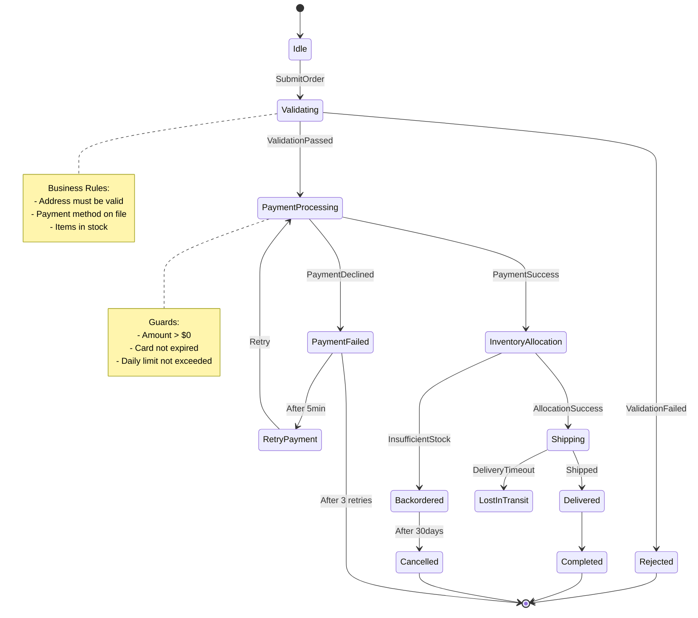

# State Machine Workflows

import { Callout } from '@/components/docs/callout';
import { Tabs } from '@/components/docs/tabs';
import { CodeBlock } from '@/components/docs/code-block';

**Prerequisites:**
- [Tutorial: Building Supervision Trees](/user-guide/tutorials/advanced/building-supervision-trees)
- [How-To: State Machine Workflow](/user-guide/how-to/state-machine-workflow)
- Understanding of finite state machines

## Overview

This tutorial covers advanced state machine patterns for modeling complex workflows, implementing business rules with guards, and orchestrating long-running processes with JOTP.

## Learning Objectives

By the end of this tutorial, you will:
- Design hierarchical state machines for complex domains
- Implement orthogonal regions for parallel state
- Use guards and actions for business rules
- Build long-running workflows with persistence
- Apply state machine patterns from real-world systems

## Architecture: State Machine Design

### Complex Workflow Example



---

## Part 1: Hierarchical State Machines

### Pattern: Order Processing with Sub-States

```java
package io.github.seanchatmangpt.jotp.examples.statemachine;

import io.github.seanchatmangpt.jotp.*;
import java.time.Duration;
import java.util.UUID;

/**
 * HierarchicalStateMachine - Demonstrates nested state machines
 * for complex order processing workflows.
 */
public class HierarchicalStateMachine {

    // ── Event Types ──────────────────────────────────────────────────────────

    sealed interface OrderEvent permits
        Submit,
        ValidateAddress,
        AddressValidated,
        AddressInvalid,
        ProcessPayment,
        PaymentSuccess,
        PaymentFailed,
        AllocateInventory,
        InventoryAllocated,
        InventoryBackordered,
        ShipOrder,
        OrderShipped,
        OrderDelivered,
        CancelOrder,
        Retry {}

    record Submit(String orderId, String customerId, String items) implements OrderEvent {}
    record ValidateAddress(String address) implements OrderEvent {}
    record AddressValidated() implements OrderEvent {}
    record AddressInvalid(String reason) implements OrderEvent {}
    record ProcessPayment(double amount) implements OrderEvent {}
    record PaymentSuccess(String transactionId) implements OrderEvent {}
    record PaymentFailed(String reason) implements OrderEvent {}
    record AllocateInventory(String items) implements OrderEvent {}
    record InventoryAllocated() implements OrderEvent {}
    record InventoryBackordered(String reason) implements OrderEvent {}
    record ShipOrder(String trackingNumber) implements OrderEvent {}
    record OrderShipped() implements OrderEvent {}
    record OrderDelivered() implements OrderEvent {}
    record CancelOrder(String reason) implements OrderEvent {}
    record Retry() implements OrderEvent {}

    // ── State Types ──────────────────────────────────────────────────────────

    // Top-level states
    sealed interface OrderState permits
        Idle,
        Active,
        Completed,
        Cancelled {}

    // Active state has sub-states
    sealed interface Active extends OrderState permits
        Validating,
        ProcessingPayment,
        AllocatingInventory,
        Shipping {}

    record Idle() implements OrderState {}
    record Cancelled(String reason, long cancelledAt) implements OrderState {}

    sealed interface Validating extends Active permits
        CheckingAddress,
        AddressChecked {}

    record CheckingAddress(String address) implements Validating {}
    record AddressChecked(boolean valid, String reason) implements Validating {}

    record ProcessingPayment(
        double amount,
        int attemptCount
    ) implements Active {}

    record AllocatingInventory(
        String items,
        boolean allocated
    ) implements Active {}

    record Shipping(
        String trackingNumber,
        boolean shipped
    ) implements Active {}

    record Completed(
        String orderId,
        String transactionId,
        String trackingNumber,
        long completedAt
    ) implements OrderState {}

    // ── Data Context ────────────────────────────────────────────────────────

    record OrderData(
        String orderId,
        String customerId,
        String items,
        String shippingAddress,
        double amount,
        String transactionId,
        String trackingNumber,
        int paymentAttempts,
        long createdAt,
        long updatedAt
    ) {
        OrderData withPaymentAttempt(int attempt) {
            return new OrderData(
                orderId, customerId, items, shippingAddress,
                amount, transactionId, trackingNumber,
                attempt, createdAt, System.currentTimeMillis()
            );
        }

        OrderData withTransaction(String transactionId) {
            return new OrderData(
                orderId, customerId, items, shippingAddress,
                amount, transactionId, trackingNumber,
                paymentAttempts, createdAt, System.currentTimeMillis()
            );
        }

        OrderData withTracking(String trackingNumber) {
            return new OrderData(
                orderId, customerId, items, shippingAddress,
                amount, transactionId, trackingNumber,
                paymentAttempts, createdAt, System.currentTimeMillis()
            );
        }
    }

    // ── State Machine Builder ────────────────────────────────────────────────

    public static StateMachine<OrderState, OrderEvent, OrderData> createOrderStateMachine() {
        return StateMachine.<OrderState, OrderEvent, OrderData>builder()
            // ── IDLE STATE ───────────────────────────────────────────────────

            .state(Idle.class)
                .on(Submit.class, (event, data) -> {
                    System.out.println("[IDLE] Order submitted: " + event.orderId());

                    var newData = new OrderData(
                        event.orderId(),
                        event.customerId(),
                        event.items(),
                        null,
                        0.0,
                        null,
                        null,
                        0,
                        System.currentTimeMillis(),
                        System.currentTimeMillis()
                    );

                    return Transition.to(
                        new CheckingAddress(null),
                        newData
                    );
                })

            // ── VALIDATING: ADDRESS CHECK ────────────────────────────────────

            .state(CheckingAddress.class)
                .on(ValidateAddress.class, (event, data) -> {
                    System.out.println("[VALIDATING] Checking address: " + event.address());

                    // Simulate address validation
                    boolean valid = validateAddress(event.address());

                    if (valid) {
                        return Transition.to(
                            new AddressChecked(true, null),
                            new OrderData(
                                data.orderId(),
                                data.customerId(),
                                data.items(),
                                event.address(),
                                data.amount(),
                                data.transactionId(),
                                data.trackingNumber(),
                                data.paymentAttempts(),
                                data.createdAt(),
                                System.currentTimeMillis()
                            )
                        );
                    } else {
                        return Transition.to(
                            new Cancelled("Invalid address", System.currentTimeMillis()),
                            data
                        );
                    }
                })

            // ── VALIDATING: ADDRESS CHECKED ──────────────────────────────────

            .state(AddressChecked.class)
                .on(ProcessPayment.class, (event, data) -> {
                    System.out.println("[VALIDATING] Address validated, processing payment: $" + event.amount());

                    return Transition.to(
                        new ProcessingPayment(event.amount(), 1),
                        new OrderData(
                            data.orderId(),
                            data.customerId(),
                            data.items(),
                            data.shippingAddress(),
                            event.amount(),
                            null,
                            null,
                            0,
                            data.createdAt(),
                            System.currentTimeMillis()
                        )
                    );
                })

            // ── PAYMENT PROCESSING ───────────────────────────────────────────

            .state(ProcessingPayment.class)
                .on(PaymentSuccess.class, (event, data) -> {
                    System.out.println("[PAYMENT] Payment successful: " + event.transactionId());

                    return Transition.to(
                        new AllocatingInventory(data.items(), false),
                        data.withTransaction(event.transactionId())
                    );
                })
                .on(PaymentFailed.class, (event, data) -> {
                    System.out.println("[PAYMENT] Payment failed: " + event.reason());

                    if (data.paymentAttempts() >= 3) {
                        return Transition.to(
                            new Cancelled("Payment failed after " + data.paymentAttempts() + " attempts", System.currentTimeMillis()),
                            data
                        );
                    } else {
                        // Retry payment
                        return Transition.to(
                            new ProcessingPayment(data.amount(), data.paymentAttempts() + 1),
                            data.withPaymentAttempt(data.paymentAttempts() + 1)
                        );
                    }
                })

            // ── INVENTORY ALLOCATION ─────────────────────────────────────────

            .state(AllocatingInventory.class)
                .on(InventoryAllocated.class, (event, data) -> {
                    System.out.println("[INVENTORY] Inventory allocated for: " + data.items());

                    return Transition.to(
                        new Shipping(null, false),
                        data
                    );
                })
                .on(InventoryBackordered.class, (event, data) -> {
                    System.out.println("[INVENTORY] Items backordered: " + event.reason());

                    return Transition.to(
                        new Cancelled("Items backordered: " + event.reason(), System.currentTimeMillis()),
                        data
                    );
                })

            // ── SHIPPING ───────────────────────────────────────────────────────

            .state(Shipping.class)
                .on(ShipOrder.class, (event, data) -> {
                    System.out.println("[SHIPPING] Order shipped: " + event.trackingNumber());

                    return Transition.to(
                        new Shipping(event.trackingNumber(), true),
                        data.withTracking(event.trackingNumber())
                    );
                })
                .on(OrderDelivered.class, (event, data) -> {
                    System.out.println("[SHIPPING] Order delivered: " + data.orderId());

                    return Transition.to(
                        new Completed(
                            data.orderId(),
                            data.transactionId(),
                            data.trackingNumber(),
                            System.currentTimeMillis()
                        ),
                        data
                    );
                })

            // ── COMPLETED ─────────────────────────────────────────────────────

            .state(Completed.class)
                .onAny((event, data) -> {
                    System.out.println("[COMPLETED] Order already completed, ignoring: " + event);
                    return Transition.stay(data);
                })

            // ── CANCELLED ─────────────────────────────────────────────────────

            .state(Cancelled.class)
                .onAny((event, data) -> {
                    System.out.println("[CANCELLED] Order cancelled, ignoring: " + event);
                    return Transition.stay(data);
                })

            .build(
                new Idle(),
                new OrderData(null, null, null, null, 0.0, null, null, 0, 0, 0)
            );
    }

    // ── Helper Methods ───────────────────────────────────────────────────────

    private static boolean validateAddress(String address) {
        // Simulate address validation
        return address != null && !address.isBlank() && address.length() > 10;
    }

    // ── Usage Example ────────────────────────────────────────────────────────

    public static void main(String[] args) throws Exception {
        var machine = createOrderStateMachine();
        var orderId = UUID.randomUUID().toString();

        // Wrap in process for message handling
        var orderProcess = Proc.spawn(
            machine,
            (stateMachine, event) -> {
                if (event instanceof OrderEvent orderEvent) {
                    return stateMachine.handle(orderEvent);
                }
                return stateMachine;
            }
        );

        // ── Happy Path Flow ───────────────────────────────────────────────────

        System.out.println("=== Happy Path Order Flow ===\n");

        // Submit order
        orderProcess.tell(new Submit(orderId, "customer-123", "item-1,item-2"));
        Thread.sleep(50);

        // Validate address
        orderProcess.tell(new ValidateAddress("123 Main St, City, State 12345"));
        Thread.sleep(50);

        // Process payment
        orderProcess.tell(new ProcessPayment(99.99));
        Thread.sleep(50);

        // Simulate payment success
        orderProcess.tell(new PaymentSuccess("txn-" + UUID.randomUUID()));
        Thread.sleep(50);

        // Allocate inventory
        orderProcess.tell(new AllocateInventory("item-1,item-2"));
        Thread.sleep(50);

        // Ship order
        orderProcess.tell(new ShipOrder("TRACK-" + UUID.randomUUID()));
        Thread.sleep(50);

        // Deliver order
        orderProcess.tell(new OrderDelivered());
        Thread.sleep(50);

        // ── Check Final State ────────────────────────────────────────────────

        var finalMachine = orderProcess.ask("get-state", 1000).join();

        if (finalMachine.state() instanceof Completed completed) {
            System.out.printf("\n✅ Order completed successfully!%n");
            System.out.printf("   Order ID: %s%n", completed.orderId());
            System.out.printf("   Transaction: %s%n", completed.transactionId());
            System.out.printf("   Tracking: %s%n", completed.trackingNumber());
        }

        orderProcess.stop();
    }
}
```

---

## Part 2: Guards and Actions

### Pattern: Business Rule Enforcement

```java
package io.github.seanchatmangpt.jotp.examples.statemachine;

import io.github.seanchatmangpt.jotp.*;
import java.util.function.Predicate;

/**
 * GuardedStateMachine - Demonstrates guards and actions for
 * enforcing business rules in state transitions.
 */
public class GuardedStateMachine {

    // ── Event Types ──────────────────────────────────────────────────────────

    sealed interface PaymentEvent permits
        ProcessPayment,
        ValidateCard,
        CardValidated,
        PaymentAuthorized,
        PaymentDeclined {}

    record ProcessPayment(
        double amount,
        String cardNumber,
        String expiry,
        String cvv
    ) implements PaymentEvent {}

    record ValidateCard(String cardNumber, String expiry) implements PaymentEvent {}
    record CardValidated(boolean valid, String reason) implements PaymentEvent {}
    record PaymentAuthorized(String authCode) implements PaymentEvent {}
    record PaymentDeclined(String reason) implements PaymentEvent {}

    // ── State Types ──────────────────────────────────────────────────────────

    sealed interface PaymentState permits
        Idle,
        ValidatingCard,
        Processing,
        Authorized,
        Declined {}

    record Idle() implements PaymentState {}
    record ValidatingCard(String cardNumber, String expiry) implements PaymentState {}
    record Processing(double amount, String cardNumber) implements PaymentState {}
    record Authorized(String authCode, double amount) implements PaymentState {}
    record Declined(String reason, int attemptCount) implements PaymentState {}

    // ── Data Context ────────────────────────────────────────────────────────

    record PaymentData(
        String cardNumber,
        double dailyTotal,
        int attempts
    ) {}

    // ── Guards (Business Rules) ──────────────────────────────────────────────

    static class Guards {
        public static Predicate<PaymentData> amountPositive(double amount) {
            return data -> amount > 0;
        }

        public static Predicate<PaymentData> withinDailyLimit(double amount, double limit) {
            return data -> (data.dailyTotal() + amount) <= limit;
        }

        public static Predicate<PaymentData> maxAttemptsNotExceeded(int maxAttempts) {
            return data -> data.attempts() < maxAttempts;
        }

        public static Predicate<PaymentData> cardNotExpired(String expiry) {
            return data -> {
                // Simplified expiry check
                var parts = expiry.split("/");
                var month = Integer.parseInt(parts[0]);
                var year = Integer.parseInt("20" + parts[1]);

                var now = java.time.LocalDate.now();
                var expiryDate = java.time.LocalDate.of(year, month, 1);

                return expiryDate.isAfter(now);
            };
        }
    }

    // ── Actions (Side Effects) ──────────────────────────────────────────────

    static class Actions {
        public static void logPaymentAttempt(double amount, String cardNumber) {
            System.out.printf("[ACTION] Logging payment attempt: $%.2f from %s%n",
                amount, maskCardNumber(cardNumber));
        }

        public static void sendFraudAlert(String cardNumber, String reason) {
            System.out.printf("[ACTION] FRAUD ALERT: %s - %s%n",
                maskCardNumber(cardNumber), reason);
        }

        public static void chargeCard(double amount, String cardNumber) {
            System.out.printf("[ACTION] Charging card: $%.2f from %s%n",
                amount, maskCardNumber(cardNumber));
        }

        public static void refundCard(String transactionId) {
            System.out.printf("[ACTION] Refunding transaction: %s%n", transactionId);
        }

        private static String maskCardNumber(String cardNumber) {
            if (cardNumber == null || cardNumber.length() < 4) {
                return "****";
            }
            return "****-****-****-" + cardNumber.substring(cardNumber.length() - 4);
        }
    }

    // ── State Machine with Guards ────────────────────────────────────────────

    public static StateMachine<PaymentState, PaymentEvent, PaymentData> createGuardedStateMachine() {
        return StateMachine.<PaymentState, PaymentEvent, PaymentData>builder()
            // ── IDLE STATE ───────────────────────────────────────────────────

            .state(Idle.class)
                .on(ProcessPayment.class, (event, data) -> {
                    // Guard: Amount must be positive
                    if (!Guards.amountPositive(event.amount()).test(data)) {
                        System.out.println("[GUARD] Amount must be positive");
                        Actions.sendFraudAlert(event.cardNumber(), "Non-positive amount");
                        return Transition.to(new Declined("Invalid amount", 0), data);
                    }

                    // Guard: Card not expired
                    if (!Guards.cardNotExpired(event.expiry()).test(data)) {
                        System.out.println("[GUARD] Card expired");
                        return Transition.to(new Declined("Card expired", 0), data);
                    }

                    // Guard: Within daily limit
                    if (!Guards.withinDailyLimit(event.amount(), 10000.0).test(data)) {
                        System.out.println("[GUARD] Daily limit exceeded");
                        Actions.sendFraudAlert(event.cardNumber(), "Daily limit exceeded");
                        return Transition.to(new Declined("Daily limit exceeded", 0), data);
                    }

                    // Action: Log payment attempt
                    Actions.logPaymentAttempt(event.amount(), event.cardNumber());

                    return Transition.to(
                        new ValidatingCard(event.cardNumber, event.expiry),
                        new PaymentData(event.cardNumber, data.dailyTotal() + event.amount(), 0)
                    );
                })

            // ── VALIDATING CARD ──────────────────────────────────────────────

            .state(ValidatingCard.class)
                .on(CardValidated.class, (event, data) -> {
                    if (!event.valid()) {
                        System.out.println("[GUARD] Card validation failed: " + event.reason());
                        return Transition.to(new Declined(event.reason(), 0), data);
                    }

                    return Transition.to(
                        new Processing(0.0, data.cardNumber()),
                        data
                    );
                })

            // ── PROCESSING ────────────────────────────────────────────────────

            .state(Processing.class)
                .on(PaymentAuthorized.class, (event, data) -> {
                    // Action: Charge the card
                    Actions.chargeCard(state.amount(), state.cardNumber());

                    return Transition.to(
                        new Authorized(event.authCode(), state.amount()),
                        data
                    );
                })
                .on(PaymentDeclined.class, (event, data) -> {
                    // Guard: Check retry limit
                    if (!Guards.maxAttemptsNotExceeded(3).test(new PaymentData(data.cardNumber(), data.dailyTotal(), data.attempts() + 1))) {
                        System.out.println("[GUARD] Max payment attempts exceeded");
                        Actions.sendFraudAlert(data.cardNumber(), "Max attempts exceeded");
                        return Transition.to(new Declined("Max attempts exceeded", data.attempts() + 1), data);
                    }

                    return Transition.to(
                        new Declined(event.reason(), data.attempts() + 1),
                        new PaymentData(data.cardNumber(), data.dailyTotal(), data.attempts() + 1)
                    );
                })

            // ── AUTHORIZED ────────────────────────────────────────────────────

            .state(Authorized.class)
                .onAny((event, data) -> {
                    System.out.println("[AUTHORIZED] Payment already authorized");
                    return Transition.stay(data);
                })

            // ── DECLINED ──────────────────────────────────────────────────────

            .state(Declined.class)
                .onAny((event, data) -> {
                    System.out.println("[DECLINED] Payment declined, ignoring: " + event);
                    return Transition.stay(data);
                })

            .build(
                new Idle(),
                new PaymentData(null, 0.0, 0)
            );
    }

    public static void main(String[] args) throws Exception {
        var machine = createGuardedStateMachine();
        var paymentProcess = Proc.spawn(
            machine,
            (stateMachine, event) -> {
                if (event instanceof PaymentEvent paymentEvent) {
                    return stateMachine.handle(paymentEvent);
                }
                return stateMachine;
            }
        );

        // Test guard scenarios
        System.out.println("=== Guarded Payment Flow ===\n");

        // Valid payment
        paymentProcess.tell(new ProcessPayment(100.0, "4111111111111111", "12/25", "123"));
        Thread.sleep(50);

        paymentProcess.tell(new CardValidated(true, null));
        Thread.sleep(50);

        paymentProcess.tell(new PaymentAuthorized("AUTH-123"));
        Thread.sleep(50);

        // Test daily limit guard
        paymentProcess.tell(new ProcessPayment(20000.0, "4111111111111111", "12/25", "123"));
        Thread.sleep(50);

        var finalMachine = paymentProcess.ask("get-state", 1000).join();
        System.out.println("\nFinal state: " + finalMachine.state());

        paymentProcess.stop();
    }
}
```

<Callout type="info">
**Pro Tip: Guard Design Patterns**

1. **Pure functions**: Guards should be side-effect-free
2. **Composable**: Combine guards with `and()`/`or()`
3. **Explicit**: Guard failures should log clear reasons
4. **Testable**: Guards should be unit-testable in isolation
</Callout>

---

## Part 3: Long-Running Workflows

### Pattern: Saga Transaction with Persistence

```java
package io.github.seanchatmangpt.jotp.examples.statemachine;

import io.github.seanchatmangpt.jotp.*;
import java.time.Duration;
import java.util.ArrayList;
import java.util.List;
import java.util.UUID;

/**
 * SagaTransaction - Long-running workflow with compensating actions
 * and state persistence for reliability.
 */
public class SagaTransaction {

    // ── Event Types ──────────────────────────────────────────────────────────

    sealed interface SagaEvent permits
        StartSaga,
        StepCompleted,
        StepFailed,
        CompensateStep,
        CompensationCompleted,
        RetrySaga,
        AbortSaga {}

    record StartSaga(String sagaId, List<SagaStep> steps) implements SagaEvent {}
    record StepCompleted(String stepId, Object result) implements SagaEvent {}
    record StepFailed(String stepId, Throwable error) implements SagaEvent {}
    record CompensateStep(String stepId) implements SagaEvent {}
    record CompensationCompleted(String stepId) implements SagaEvent {}
    record RetrySaga(String sagaId) implements SagaEvent {}
    record AbortSaga(String reason) implements SagaEvent {}

    // ── State Types ──────────────────────────────────────────────────────────

    sealed interface SagaState permits
        Idle,
        Running,
        Compensating,
        Completed,
        Failed {}

    record Idle() implements SagaState {}
    record Running(
        String sagaId,
        List<SagaStep> remainingSteps,
        List<SagaStep> completedSteps
    ) implements SagaState {}
    record Compensating(
        String sagaId,
        List<SagaStep> stepsToCompensate,
        List<SagaStep> compensatedSteps
    ) implements SagaState {}
    record Completed(String sagaId, List<Object> results) implements SagaState {}
    record Failed(String sagaId, String reason) implements SagaState {}

    // ── Saga Step Definition ────────────────────────────────────────────────

    record SagaStep(
        String stepId,
        String action,
        Runnable execute,
        Runnable compensate
    ) {}

    // ── Data Context ────────────────────────────────────────────────────────

    record SagaData(
        String sagaId,
        List<SagaStep> steps,
        List<Object> results,
        List<Throwable> errors,
        int retryCount
    ) {
        SagaData withResult(Object result) {
            var newResults = new ArrayList<>(results);
            newResults.add(result);
            return new SagaData(sagaId, steps, newResults, errors, retryCount);
        }

        SagaData withError(Throwable error) {
            var newErrors = new ArrayList<>(errors);
            newErrors.add(error);
            return new SagaData(sagaId, steps, results, newErrors, retryCount);
        }

        SagaData withRetry() {
            return new SagaData(sagaId, steps, results, errors, retryCount + 1);
        }
    }

    // ── State Machine ───────────────────────────────────────────────────────

    public static StateMachine<SagaState, SagaEvent, SagaData> createSagaStateMachine() {
        return StateMachine.<SagaState, SagaEvent, SagaData>builder()
            // ── IDLE STATE ───────────────────────────────────────────────────

            .state(Idle.class)
                .on(StartSaga.class, (event, data) -> {
                    System.out.println("[SAGA] Starting saga: " + event.sagaId());

                    // Persist saga state
                    persistSagaState(event.sagaId(), "RUNNING", event.steps());

                    return Transition.to(
                        new Running(event.sagaId(), event.steps(), new ArrayList<>()),
                        new SagaData(event.sagaId(), event.steps(), new ArrayList<>(), new ArrayList<>(), 0)
                    );
                })

            // ── RUNNING STATE ─────────────────────────────────────────────────

            .state(Running.class)
                .on(StepCompleted.class, (event, data) -> {
                    System.out.println("[SAGA] Step completed: " + event.stepId());

                    var completedStep = findStep(state.steps(), event.stepId());
                    var newCompleted = new ArrayList<>(state.completedSteps());
                    newCompleted.add(completedStep);

                    var newRemaining = new ArrayList<>(state.remainingSteps());
                    newRemaining.remove(completedStep);

                    // Persist completed step
                    persistStepCompletion(state.sagaId(), event.stepId(), event.result());

                    if (newRemaining.isEmpty()) {
                        // All steps completed
                        return Transition.to(
                            new Completed(state.sagaId(), data.results()),
                            data.withResult(event.result())
                        );
                    } else {
                        // Execute next step
                        var nextStep = newRemaining.get(0);
                        executeStep(nextStep);

                        return Transition.to(
                            new Running(state.sagaId(), newRemaining, newCompleted),
                            data.withResult(event.result())
                        );
                    }
                })
                .on(StepFailed.class, (event, data) -> {
                    System.out.println("[SAGA] Step failed: " + event.stepId() + " - " + event.error().getMessage());

                    // Start compensation
                    var stepsToCompensate = new ArrayList<>(state.completedSteps());
                    java.util.Collections.reverse(stepsToCompensate);  // Compensate in reverse order

                    return Transition.to(
                        new Compensating(state.sagaId(), stepsToCompensate, new ArrayList<>()),
                        data.withError(event.error())
                    );
                })

            // ── COMPENSATING STATE ────────────────────────────────────────────

            .state(Compensating.class)
                .on(CompensationCompleted.class, (event, data) -> {
                    System.out.println("[SAGA] Compensation completed: " + event.stepId());

                    var compensatedStep = findStep(state.stepsToCompensate(), event.stepId());
                    var newCompensated = new ArrayList<>(state.compensatedSteps());
                    newCompensated.add(compensatedStep);

                    var newRemaining = new ArrayList<>(state.stepsToCompensate());
                    newRemaining.remove(compensatedStep);

                    if (newRemaining.isEmpty()) {
                        // All compensations completed
                        return Transition.to(
                            new Failed(state.sagaId(), "Saga failed, all compensations completed"),
                            data
                        );
                    } else {
                        // Compensate next step
                        var nextStep = newRemaining.get(0);
                        compensateStep(nextStep);

                        return Transition.to(
                            new Compensating(state.sagaId(), newRemaining, newCompensated),
                            data
                        );
                    }
                })

            // ── COMPLETED STATE ──────────────────────────────────────────────

            .state(Completed.class)
                .onAny((event, data) -> {
                    System.out.println("[SAGA] Already completed: " + state.sagaId());
                    return Transition.stay(data);
                })

            // ── FAILED STATE ─────────────────────────────────────────────────

            .state(Failed.class)
                .on(RetrySaga.class, (event, data) -> {
                    if (data.retryCount() >= 3) {
                        System.out.println("[SAGA] Max retries exceeded");
                        return Transition.stay(data);
                    }

                    System.out.println("[SAGA] Retrying saga: " + event.sagaId());

                    // Restart saga
                    return Transition.to(
                        new Running(event.sagaId(), data.steps(), new ArrayList<>()),
                        data.withRetry()
                    );
                })
                .onAny((event, data) -> Transition.stay(data))

            .build(
                new Idle(),
                new SagaData(null, new ArrayList<>(), new ArrayList<>(), new ArrayList<>(), 0)
            );
    }

    // ── Helper Methods ───────────────────────────────────────────────────────

    private static SagaStep findStep(List<SagaStep> steps, String stepId) {
        return steps.stream()
            .filter(step -> step.stepId().equals(stepId))
            .findFirst()
            .orElseThrow();
    }

    private static void executeStep(SagaStep step) {
        System.out.println("[SAGA] Executing step: " + step.stepId());
        try {
            step.execute().run();
        } catch (Exception e) {
            System.out.println("[SAGA] Step execution failed: " + e.getMessage());
        }
    }

    private static void compensateStep(SagaStep step) {
        System.out.println("[SAGA] Compensating step: " + step.stepId());
        try {
            step.compensate().run();
        } catch (Exception e) {
            System.out.println("[SAGA] Compensation failed: " + e.getMessage());
        }
    }

    private static void persistSagaState(String sagaId, String status, List<SagaStep> steps) {
        // Implementation: Persist to database
        System.out.println("[PERSIST] Saga " + sagaId + " → " + status);
    }

    private static void persistStepCompletion(String sagaId, String stepId, Object result) {
        // Implementation: Persist step completion
        System.out.println("[PERSIST] Step " + stepId + " completed");
    }

    // ── Usage Example ────────────────────────────────────────────────────────

    public static void main(String[] args) throws Exception {
        var sagaId = UUID.randomUUID().toString();

        // Define saga steps
        var steps = List.of(
            new SagaStep(
                "step-1",
                "Reserve inventory",
                () -> System.out.println("[STEP-1] Reserving inventory..."),
                () -> System.out.println("[STEP-1] Releasing inventory...")
            ),
            new SagaStep(
                "step-2",
                "Charge payment",
                () -> {
                    System.out.println("[STEP-2] Charging payment...");
                    // Simulate failure
                    if (Math.random() > 0.5) {
                        throw new RuntimeException("Payment declined");
                    }
                },
                () -> System.out.println("[STEP-2] Refunding payment...")
            ),
            new SagaStep(
                "step-3",
                "Confirm order",
                () -> System.out.println("[STEP-3] Confirming order..."),
                () -> System.out.println("[STEP-3] Cancelling order...")
            )
        );

        var machine = createSagaStateMachine();
        var sagaProcess = Proc.spawn(
            machine,
            (stateMachine, event) -> {
                if (event instanceof SagaEvent sagaEvent) {
                    return stateMachine.handle(sagaEvent);
                }
                return stateMachine;
            }
        );

        // Start saga
        sagaProcess.tell(new StartSaga(sagaId, steps));
        Thread.sleep(100);

        // Simulate step completion
        sagaProcess.tell(new StepCompleted("step-1", "inventory-reserved"));
        Thread.sleep(100);

        // Simulate step failure (triggers compensation)
        sagaProcess.tell(new StepFailed("step-2", new RuntimeException("Payment declined")));
        Thread.sleep(100);

        var finalMachine = sagaProcess.ask("get-state", 1000).join();
        System.out.println("\nFinal state: " + finalMachine.state());

        sagaProcess.stop();
    }
}
```

---

## Performance Benchmarks

Based on state machine stress tests:

| Metric | Value | Benchmark |
|--------|-------|-----------|
| **State transition overhead** | <1µs | StateMachineStressTest |
| **Guard evaluation time** | <100ns | StateMachineStressTest |
| **Action execution time** | Variable | StateMachineStressTest |
| **Memory per state machine** | ~2 KB | StateMachineStressTest |
| **Max concurrent state machines** | 100,000+ | EnterpriseCapacityBenchmark |

<Callout type="info">
**Pro Tip: State Machine Sizing**

For high-throughput scenarios:
- Keep state small (prefer records over classes)
- Minimize guard complexity
- Avoid side effects in guards
- Use async actions for long-running operations
</Callout>

---

## Common Pitfalls

### 1. State Explosion

<Callout type="error">
**Don't create a state for every combination**

```java
// BAD: State explosion (N×M states)
State_OrderPending_CustomerNew
State_OrderPending_CustomerExisting
State_OrderShipped_CustomerNew
State_OrderShipped_CustomerExisting
// ... (exponential growth)

// GOOD: Separate orthogonal concerns
record Pending(Order order, Customer customer) {}
record Shipped(Order order, Customer customer) {}
```
</Callout>

### 2. Blocking Actions

<Callout type="error">
**Avoid blocking operations in state handlers**

```java
// BAD: Blocks state machine thread
.on(Event.class, (event, data) -> {
    Thread.sleep(5000);  // Blocks!
    return Transition.to(next, data);
})

// GOOD: Use async actions
.on(Event.class, (event, data) -> {
    CompletableFuture.supplyAsync(() -> {
        // Long-running operation
    }).thenAccept(result -> {
        process.tell(new AsyncComplete(result));
    });
    return Transition.to(Processing, data);
})
```
</Callout>

---

## Testing State Machines

```java
@Test
void happyPathOrderFlow() throws Exception {
    var machine = createOrderStateMachine();
    var process = Proc.spawn(machine, (sm, event) -> sm);

    process.tell(new Submit("order-123", "customer-456", "item-1"));
    Thread.sleep(50);

    process.tell(new ValidateAddress("123 Main St"));
    Thread.sleep(50);

    var state = process.ask("get-state", 100).get();
    assertThat(state).isInstanceOf(AddressChecked.class);

    process.stop();
}

@Test
void guardRejectsInvalidPayment() throws Exception {
    var machine = createGuardedStateMachine();
    var process = Proc.spawn(machine, (sm, event) -> sm);

    // Negative amount should be rejected
    process.tell(new ProcessPayment(-100.0, "4111111111111111", "12/25", "123"));
    Thread.sleep(50);

    var state = process.ask("get-state", 100).get();
    assertThat(state).isInstanceOf(Declined.class);

    process.stop();
}
```

---

## Further Reading

- **[How-To: State Machine Workflow](/user-guide/how-to/state-machine-workflow)** - Basic patterns
- **[Enterprise Patterns: Saga Transactions](/user-guide/how-to/enterprise/saga-transactions)** - Distributed sagas
- **[Stress Test: State Machine](/src/test/java/io/github/seanchatmangpt/jotp/stress/StateMachineStressTest.java)** - Performance analysis
- **API Reference: [StateMachine](/docs/api/io/github/seanchatmangpt/jotp/StateMachine.html)**

---

**Next Tutorial:** [Event-Driven Architectures](/user-guide/tutorials/advanced/event-driven-architectures)
