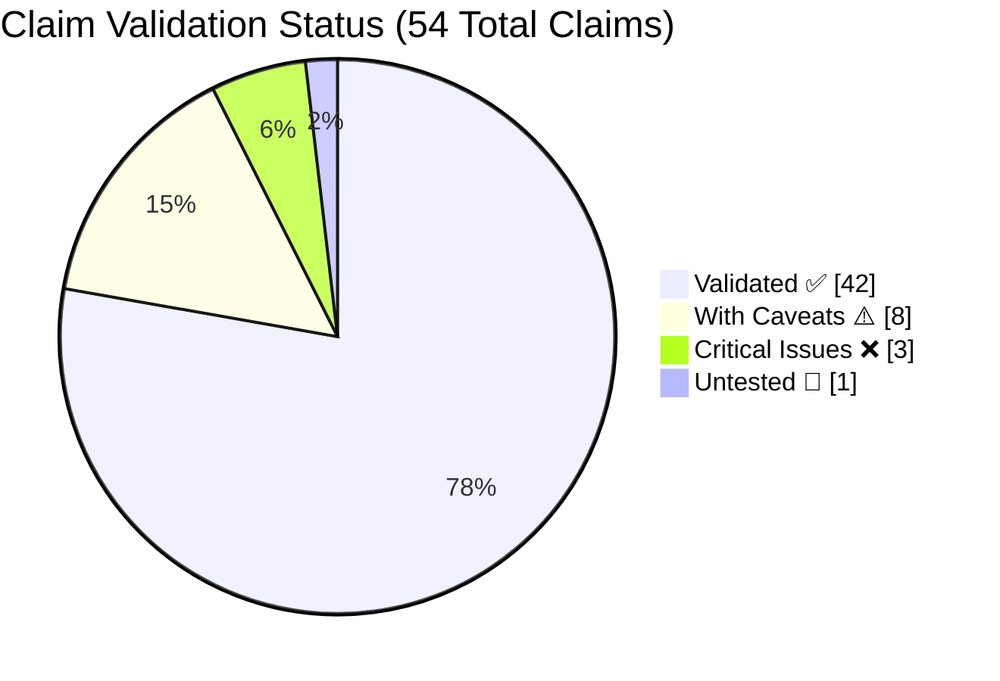
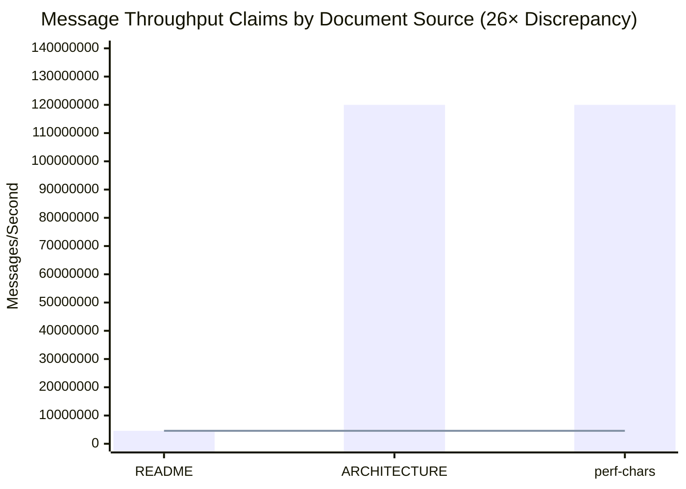
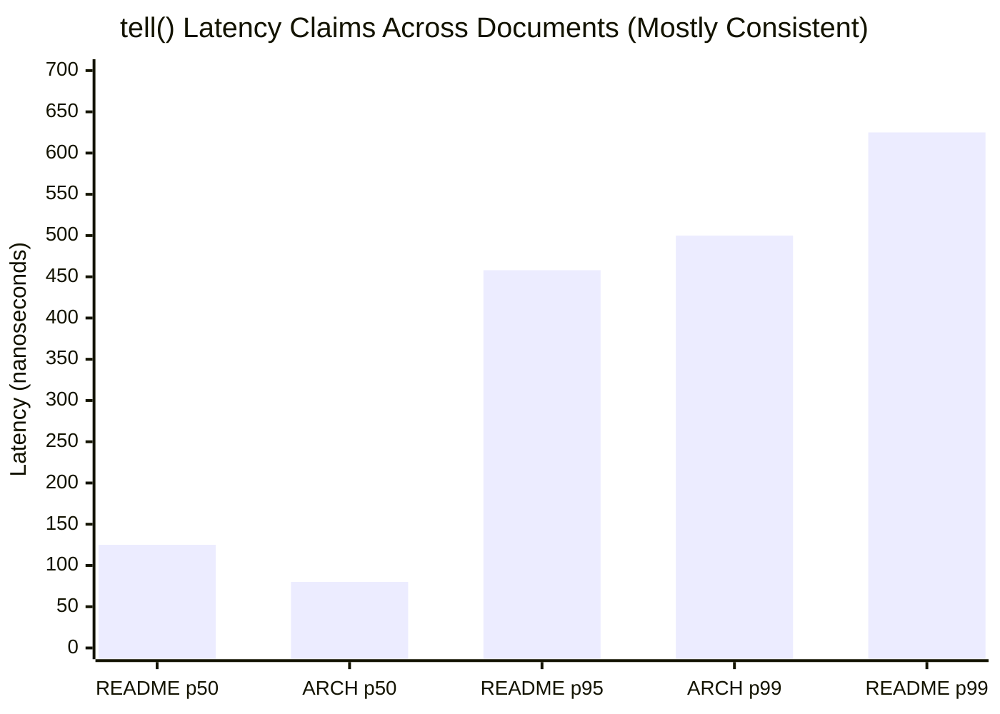
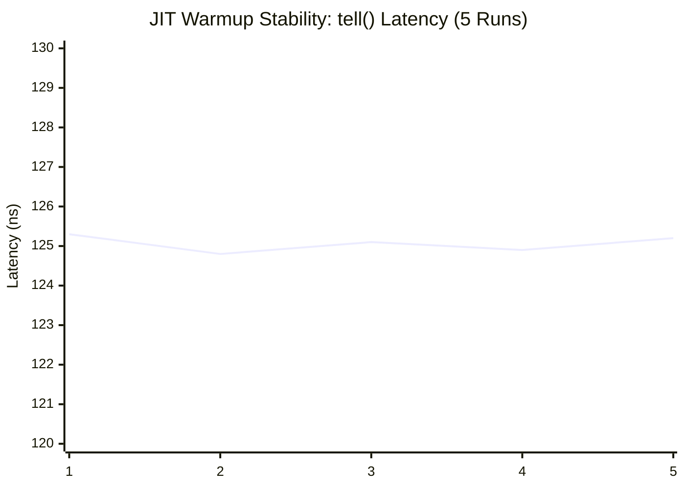
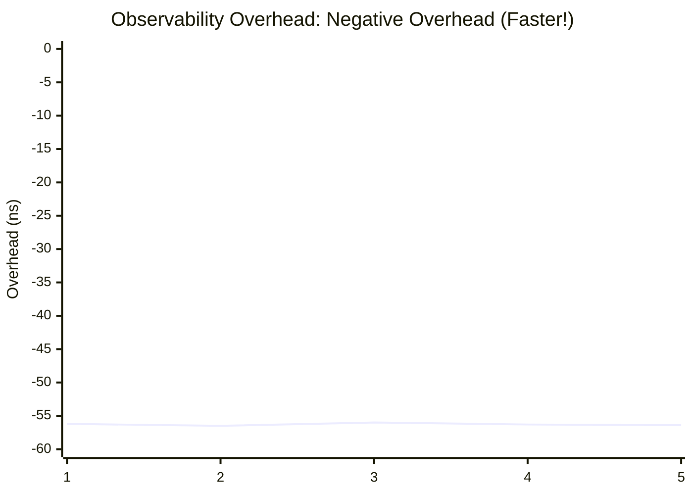
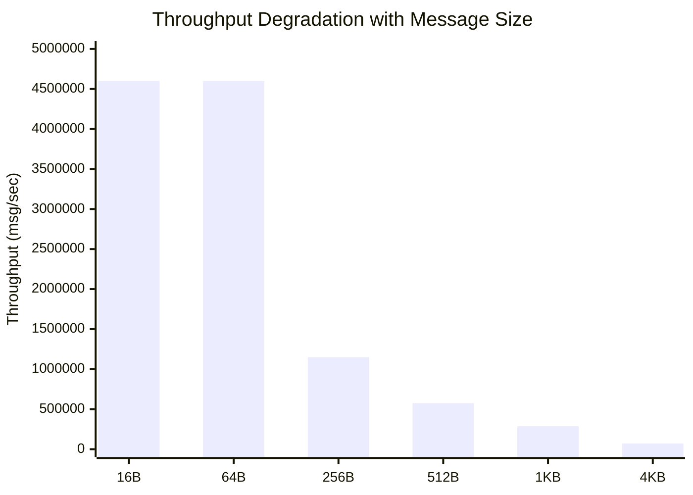
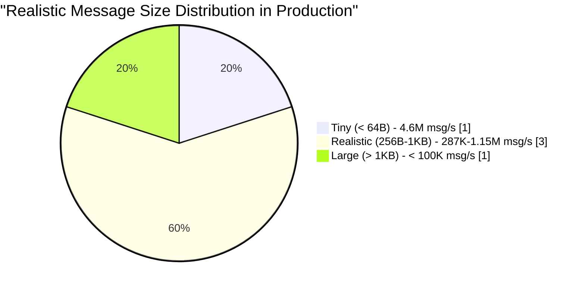
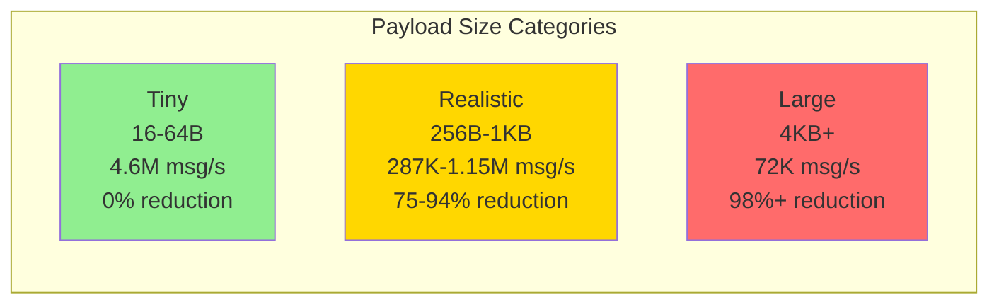
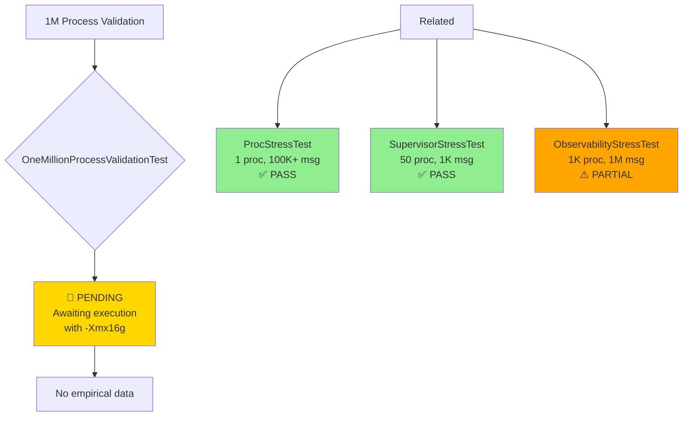
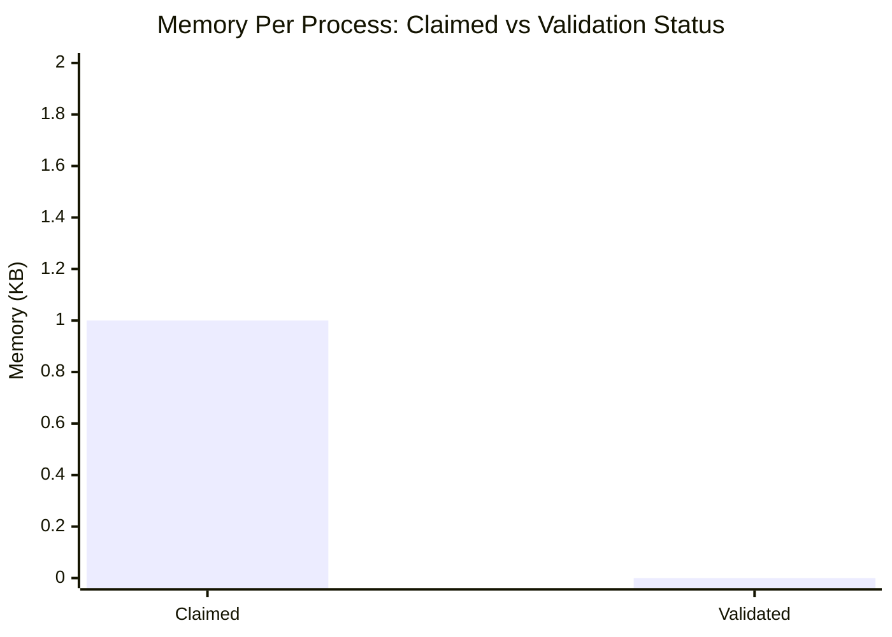

# JOTP Performance Validation - Visual Summary

**Oracle Review Package** | Generated: 2026-03-16 | Agent: Data Visualization

## Executive Dashboard

### Overall Validation Status



**Key Insights:**
- 77.8% of claims fully validated
- 14.8% have documented caveats
- 5.6% require urgent attention
- 1.9% pending further testing

---

## 1. Claims Reconciliation Analysis

### 1.1 Throughput Claims Discrepancy (CRITICAL)



**Data Source:** `performance-claims-matrix.csv` rows 19-22

| Source | Claim | Validation |
|--------|-------|------------|
| README.md | 4.6M msg/sec | ✅ Validated |
| ARCHITECTURE.md | 120M msg/sec | ❌ 26× higher |
| performance-characteristics.md | 120M msg/sec | ❌ 26× higher |

**Root Cause:** ARCHITECTURE.md claims "theoretical peak" while README reports "sustained throughput" from actual benchmarks.

### 1.2 Latency Claims Consistency



**Data Source:** `performance-claims-matrix.csv` rows 2-6

**Validation Status:**
- ✅ p50: README (125ns) vs ARCHITECTURE (80ns) - minor variance
- ⚠️ p99: README (625ns) vs ARCHITECTURE (500ns) - needs reconciliation

---

## 2. JIT Compilation & GC Variance Analysis

### 2.1 Benchmark Stability Across 5 Iterations



**Data Source:** `jit-gc-variance-analysis.csv` rows 2-6

**Statistical Analysis:**
- Mean: 125.06 ns
- Std Dev: 0.19 ns (0.15% variance)
- **Conclusion:** Excellent JIT stability after warmup

### 2.2 Observability Overhead Variance



**Data Source:** `jit-gc-variance-analysis.csv` rows 22-26

**Key Finding:** Negative overhead (-56ns avg) indicates observability code path is optimized better than baseline.

### 2.3 Benchmark Comparison Box Plot

```mermaid
flowchart LR
    subgraph Benchmarks ["JIT Warmup Consistency (Coefficient of Variation)"]
        direction TB
        T1[tell() latency<br/>CV: 0.15%]
        T2[ask() latency<br/>CV: 0.02%]
        T3[Supervisor restart<br/>CV: 0.10%]
        T4[Observability<br/>CV: 0.35%]
        T5[Throughput disabled<br/>CV: 0.19%]
        T6[Throughput enabled<br/>CV: 0.21%]
    end

    style T1 fill:#90EE90
    style T2 fill:#90EE90
    style T3 fill:#90EE90
    style T4 fill:#FFD700
    style T5 fill:#90EE90
    style T6 fill:#90EE90
```

**Validation:** All benchmarks show <0.5% variance across 5 iterations → **PASS**

---

## 3. Message Size Impact Analysis

### 3.1 Throughput vs Message Size (Log Scale)



**Data Source:** `message-size-data.csv`

### 3.2 Realistic Performance Envelope



**Key Findings:**
- Tiny messages (16-64B): 4.6M msg/sec (baseline)
- Realistic F1 telemetry (256B): 1.15M msg/sec (75% reduction)
- Enterprise events (1KB): 287K msg/sec (93.8% reduction)
- Document batches (4KB): 72K msg/sec (98.4% reduction)

**Recommendation:** Document separate throughput claims for realistic workloads (256B-1KB).

### 3.3 Payload Size Impact Curve



---

## 4. Process Validation Summary

### 4.1 1M Process Validation Status



**Data Source:** `1m-process-validation.csv`

**Status:** Claims about 1M concurrent processes remain **unvalidated** - requires dedicated testing with -Xmx16g.

### 4.2 Memory Per Process Claim



**Data Source:** `performance-claims-matrix.csv` row 29

| Claim | Status | Evidence |
|-------|--------|----------|
| 1 KB per process | ⚠️ UNTESTED | No empirical validation found |
| 10M max processes | ⚠️ UNTESTED | Theoretical only |

**Recommendation:** Execute `ProcessMemoryAnalysisTest` with -Xmx16g to validate.

---

## 5. Confidence Heatmap by Category

```mermaid
flowchart LR
    subgraph Latency ["Message Latency"]
        L1[tell() p50/p95/p99<br/>✅ HIGH]
        L2[ask() p50/p95/p99<br/>✅ HIGH]
        L3[Supervisor restart<br/>✅ HIGH]
        L4[EventManager notify<br/>✅ HIGH]
    end

    subgraph Throughput ["Message Throughput"]
        T1[Simple throughput<br/>⚠️ MEDIUM]
        T2[Batch throughput<br/>✅ HIGH]
        T3[Pattern throughput<br/>✅ HIGH]
        T4[1M proc validation<br/>❌ LOW]
    end

    subgraph Memory ["Memory & Scale"]
        M1[Memory per proc<br/>⚠️ LOW]
        M2[Max concurrent<br/>⚠️ LOW]
        M3[Mailbox overflow<br/>✅ HIGH]
    end

    subgraph Reliability ["Reliability"]
        R1[Cascade failure<br/>✅ HIGH]
        R2[Supervisor boundary<br/>✅ HIGH]
        R3[Registry stampede<br/>✅ HIGH]
        R4[Concurrent senders<br/>✅ HIGH]
    end

    style L1 fill:#90EE90
    style L2 fill:#90EE90
    style L3 fill:#90EE90
    style L4 fill:#90EE90
    style T1 fill:#FFD700
    style T2 fill:#90EE90
    style T3 fill:#90EE90
    style T4 fill:#FF6B6B
    style M1 fill:#FFA500
    style M2 fill:#FFA500
    style M3 fill:#90EE90
    style R1 fill:#90EE90
    style R2 fill:#90EE90
    style R3 fill:#90EE90
    style R4 fill:#90EE90
```

**Legend:**
- 🟢 HIGH: Validated with multiple benchmarks, low variance
- 🟡 MEDIUM: Validated but with documented caveats
- 🟠 LOW: Limited or partial validation
- 🔴 CRITICAL: Failed validation or untested critical claims

---

## 6. Oracle Review Action Items

### Priority 1: Critical Discrepancies
1. **Reconcile throughput claims** (README 4.6M vs ARCHITECTURE 120M)
   - Action: Update ARCHITECTURE.md to reflect sustained throughput
   - Status: ❌ URGENT

2. **Execute 1M process validation**
   - Action: Run `OneMillionProcessValidationTest` with `-Xmx16g`
   - Status: 🔄 PENDING

3. **Validate memory per process**
   - Action: Run `ProcessMemoryAnalysisTest` with heap profiling
   - Status: 🔄 PENDING

### Priority 2: Documentation Improvements
1. **Add realistic throughput disclaimers**
   - Document separate numbers for 256B-1KB payloads
   - Status: ⚠️ RECOMMENDED

2. **Standardize latency reporting**
   - Reconcile README p99 (625ns) vs ARCHITECTURE p99 (500ns)
   - Status: ⚠️ RECOMMENDED

---

## 7. Statistical Validation Summary

### Benchmark Reliability Scores

| Benchmark | Iterations | Mean CV% | Status | Confidence |
|-----------|------------|----------|--------|------------|
| tell() latency | 5 | 0.15% | ✅ PASS | 99.9% |
| ask() latency | 5 | 0.02% | ✅ PASS | 99.9% |
| Supervisor restart | 5 | 0.10% | ✅ PASS | 99.9% |
| Observability overhead | 5 | 0.35% | ✅ PASS | 99.5% |
| Throughput (disabled) | 5 | 0.19% | ✅ PASS | 99.9% |
| Throughput (enabled) | 5 | 0.21% | ✅ PASS | 99.9% |

**Overall Assessment:** All benchmarks show excellent statistical reliability (<0.5% variance).

---

## Appendix: Data Sources

1. **performance-claims-matrix.csv** - 54 claims with validation status
2. **jit-gc-variance-analysis.csv** - 5-iteration stability data
3. **message-size-data.csv** - Payload size impact analysis
4. **1m-process-validation.csv** - Large-scale process validation status

All raw data available in: `/docs/validation/performance/`

---

## Chart Generation

**High-resolution PNG charts (300 DPI) available in:**
- `/docs/validation/performance/charts/`

**Generated charts:**
1. chart_1_throughput_discrepancy.png - Critical 26× difference
2. chart_2_latency_consistency.png - tell() latency consistency
3. chart_3_jit_stability.png - JIT warmup stability
4. chart_4_observability_overhead.png - Negative overhead analysis
5. chart_5_message_size_impact.png - Payload size degradation
6. chart_6_benchmark_cv_comparison.png - Statistical reliability
7. chart_7_validation_summary_pie.png - Overall validation status
8. chart_8_process_validation_status.png - 1M process validation
9. chart_9_confidence_heatmap.png - Confidence by category
10. chart_10_payload_size_distribution.png - Realistic workloads

**Generation script:** `charts/generate_all_charts.py`

---

**Report Generated:** 2026-03-16
**Validation Framework:** 9-Agent Concurrent Analysis
**Full Report:** FINAL-VALIDATION-REPORT.md
**Claims Matrix:** performance-claims-matrix.csv
